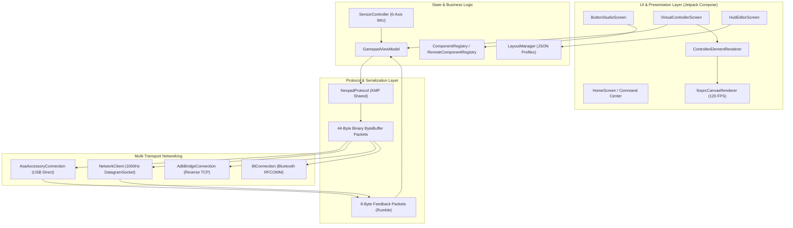

# 🏛️ NEXPAD Android Architecture

Deep technical design, runtime pipelines, and component models of the **NEXPAD Android** client application.

```
                    ┌───────────────┐
                    │   README.md   │
                    │ "What is it?" │
                    └───────┬───────┘
                            │
          ┌─────────────────┼──────────────────┐
          ▼                 ▼                  ▼
     HISTORY.md         ROADMAP.md       ARCHITECTURE.md
     "Where we         "Where we're       "How it
      came from"          going"           works"
```

---

## 🏗️ High-Level System Architecture



---

## ⚡ Multi-Transport Subsystem

NEXPAD supports 4 interchangeable transport engines governed by `IGamepadConnection`:

1. **Android Open Accessory (AOA) - USB Direct**:
   - Uses `android.hardware.usb.UsbManager` to claim accessory mode (`VID 0x18D1, PID 0x2D00 / 0x2D01`).
   - Obtains a raw `ParcelFileDescriptor` to perform high-throughput, zero-driver streaming over USB endpoints.
   - Operates with $< 1\,\text{ms}$ latency and zero network packet loss.
2. **Ultra-Low Latency UDP (1000Hz)**:
   - Microsecond polling loop executing on a dedicated pinned `Dispatchers.IO` coroutine thread.
   - Emits 44-byte binary datagrams (`PACKET_TYPE_INPUT = 0x01`) at up to $1000\,\text{packets/sec}$.
   - Receives 8-byte rumble feedback packets (`PACKET_TYPE_FEEDBACK = 0x02`) asynchronously.
3. **ADB Bridge (Reverse TCP Port Forwarding)**:
   - Connects to `127.0.0.1:9997` configured via `adb reverse tcp:9997 tcp:9997`.
   - Guaranteed reliable stream over standard USB debugging.
4. **Bluetooth RFCOMM**:
   - Standard RFCOMM socket communicating with PC Bluetooth stack for untethered wireless gaming.

---

## 🎨 NXPRC Vector & Animation Engine

The `.nxprc` runtime interprets custom vector button skins without loading external DEX bytecode, ensuring complete Google Play Store compliance.

### 1. Vector Compilation Pipeline
- Parses XML/HTML DOM trees into structured geometric primitives.
- Renders `<circle>`, `<rect>`, `<path>` (Bézier curves), `<line>`, `<polygon>`, and `<polyline>` directly onto Jetpack Compose `androidx.compose.ui.graphics.drawscope.DrawScope`.
- Calculates accurate bounding boxes and normalized center coordinates for dynamic scaling.

### 2. Universal Timeline Track Engine
- Dynamic piecewise-linear keyframe timeline track system interpolating multi-property animations at $120\,\text{FPS}$:
  - **Transform Tracks**: Scale, translation, rotation, and skew.
  - **Color & Glow Tracks**: Linear and conic RGB color transitions, alpha fading, and variable-radius shadow blur.
  - **Physical Feedback Tracks**: Real-time thumbstick 2D deflection vector offsets, trigger depression travel, and rumble jitter actuation.

### 3. Shader & Gradient Parity
- **Conic Gradients**: Emulates CSS `conic-gradient()` using hardware-accelerated sweep shaders (`androidx.compose.ui.graphics.Brush.sweepGradient`).
- **Linear & Radial Gradients**: Dynamic multi-stop color distributions with angle translation.
- **Layer Compositing**: Offscreen render buffers with PorterDuff blend modes for inner glows and border cutouts.

---

## 🕹️ 6-Axis Motion & Gyroscope Steering

The `SensorController` accesses Android's physical IMU hardware (`TYPE_ACCELEROMETER`, `TYPE_GYROSCOPE`, and `TYPE_ROTATION_VECTOR`):
- **Steering Wheel Emulation**: Computes real-time tilt angle $\theta = \arctan2(a_y, a_x)$ normalized to Xbox 360 left stick horizontal axis $[-32768, 32767]$.
- **CemuHook DSU Protocol**: Generates standard Cemuhook motion packets over UDP, enabling native motion aiming in Nintendo Switch and Wii U emulators (Cemu, Yuzu, Ryujinx, RPCS3).
