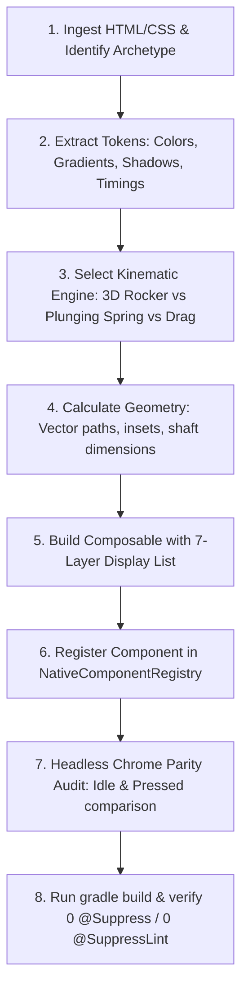

# NEXPAD — Universal HTML/CSS to Native Jetpack Compose Blueprint
## The Master Engineering Architecture for ANY Gamepad Control Archetype & Visual Style

This blueprint is NEXPAD's **universal conversion standard**. It covers the translation of **ANY** HTML/CSS controller button, joystick, trigger, bumper, or cluster—regardless of whether it is an optical lens, brushed metal, retro mechanical arcade, cybernetic neon, flat minimalist, or glassmorphic design.

---

## Table of Contents
1. [The 6 Controller Archetypes (Universal Classification)](#1-the-6-controller-archetypes-universal-classification)
2. [The 5 CSS Visual Design Styles & Compose Equivalents](#2-the-5-css-visual-design-styles--compose-equivalents)
3. [Universal CSS-to-Compose Property Mapping Matrix](#3-universal-css-to-compose-property-mapping-matrix)
4. [Kinematic Physics Engines (By Interaction Type)](#4-kinematic-physics-engines-by-interaction-type)
5. [Universal Touch, Drag & Hitbox Engine](#5-universal-touch-drag--hitbox-engine)
6. [The Universal 7-Layer Display List Pipeline](#6-the-universal-7-layer-display-list-pipeline)
7. [Step-by-Step Translation Algorithm for ANY Input HTML](#7-step-by-step-translation-algorithm-for-any-input-html)
8. [Automated Verification Pipeline: Python, Headless Chrome & Tests](#8-automated-verification-pipeline-python-headless-chrome--tests)
9. [Zero-Tolerance Architecture & Android Quality Rules](#9-zero-tolerance-architecture--android-quality-rules)

---

## 1. The 6 Controller Archetypes (Universal Classification)

Every HTML/CSS controller component falls into one of these 6 archetypes. Identify the archetype first:

| Archetype | Canonical Key | HTML/CSS Signature | Native Compose Interaction Model |
|---|---|---|---|
| **Action Button** | `A`, `B`, `X`, `Y` | Circular/square button, `:active` translateY or scale | Linear plunging spring (`scale` 0.95 + `offsetY` 2-4dp) |
| **Directional Pad (D-Pad)** | `DPAD` (Cluster) | Cross/disc shape, SVG arms, multi-directional tilt | 3D Rocker pivot (`rotationX`/`rotationY` on center ball-joint) |
| **Analog Joystick** | `LS`, `RS` | Base socket + thumb cap, `transform: translate(dx, dy)` | 2D polar vector clamping (`hypot`, `atan2`), spring decay |
| **Shoulder Bumper** | `LB`, `RB` | Asymmetric pill/wedge, slight corner radius tilt | Pivot hinge plunge (`scale` 0.96 + `offsetY` 2dp, edge shadow) |
| **Analog Trigger** | `LT`, `RT` | Deep pedal/shoe shape, vertical translation travel | Progressive 1D travel (`offsetY` 4-8dp + depth compression) |
| **System Button** | `START`, `BACK`, `GUIDE`, `SHARE` | Small pill/circle, flush bezel, minimal travel | Tactile micro-snap (`scale` 0.92, quick 50ms snap) |

> [!IMPORTANT]
> **Cluster Rule**: When an HTML file defines a composite control (e.g. an entire D-Pad with 4 arms or an analog stick with socket + thumb cap), **NEVER split it into separate button variants**. Always build a single unified Composable mapped to the parent key (e.g., `ControlKey.DPAD`).

---

## 2. The 5 CSS Visual Design Styles & Compose Equivalents

Whatever visual art style the HTML uses, map it to these native rendering formulas:

### Style A: Optical Lens / Acrylic Dome (e.g. Lens Series)
- **Convex Dome**: Multi-stop `Brush.radialGradient` with off-center zenith: `Offset(w * 0.50f, h * 0.45f)`.
- **Recessed Undercut Shadow**: Vertical gradient `Transparent` → `Black.copy(0.70f)` over bottom 35%.
- **Recessed Inset Ribbon**: Contracted vector path (`insetDp`) with dual-pass stroke (halo bloom + filament).
- **Glass Specular Arc**: Top 180° crescent gradient (`Color.White.copy(0.14f)` → `Transparent`) + bottom-right sheen oval.

### Style B: Brushed Metal / Chamfered Industrial
- **Radial/Conic Bevel**: Conic gradient highlight/shadow pairs simulating 45° ambient lighting.
- **Chamfered Metallic Rim**: 1.5dp border with dual-tone gradient (`White.copy(0.40f)` at top-left, `Black.copy(0.60f)` at bottom-right).
- **Brushed Texture**: Repeating micro-lines or dash effects (`PathEffect.dashPathEffect(floatArrayOf(2f, 4f), 0f)`).

### Style C: Retro Mechanical Arcade / Chunky Switch
- **Hard Cast Shadow**: Solid black offset shadow without blur (`Modifier.offset(x = 0.dp, y = 6.dp)` on idle; collapses to `0.dp` on press).
- **Concave Dish Cap**: Radial gradient with darker center (`#1a1a1a`) transitioning to lighter rim (`#333333`).
- **Heavy Bevel Border**: 3dp–5dp solid border with crisp 90° corners or classic arcade bevel.

### Style D: Cyberpunk Neon / Laser Wireframe
- **Multi-Stage Emissive Bloom**: 3-tier stroke rendering:
  1. Outer atmospheric aura: 12dp stroke at alpha `0.15f`.
  2. Core glow bloom: 6dp stroke at alpha `0.45f`.
  3. Laser filament core: 2dp stroke at alpha `1.0f` (pure white or vibrant neon).
- **Chassis Bleed**: `Modifier.drawBehind { drawCircle(neonColor.copy(0.35f), radius + 10.dp) }`.

### Style E: Glassmorphism / Frosted Acrylic
- **Translucent Fill**: `Color(0xFFFFFF).copy(alpha = 0.08f)` over dark backgrounds.
- **Specular Border Gradient**: Linear gradient from `White.copy(0.30f)` (top-left) to `White.copy(0.05f)` (bottom-right).
- **Sub-surface Diffusion**: Inner soft glow using radial gradient with high blur spread.

---

## 3. Universal CSS-to-Compose Property Mapping Matrix

| CSS Property | Compose Native Implementation | Technical Formula / Key Nuance |
|---|---|---|
| `background: radial-gradient(circle at X% Y%, c1, c2, c3)` | `Brush.radialGradient(listOf(c1, c2, c3), center = Offset(w * X/100f, h * Y/100f), radius = R)` | Sets physical light source zenith |
| `box-shadow: 0 4px 10px rgba(0,0,0,0.6)` | `Modifier.shadow(elevation = 10.dp, shape = Shape)` | Outer drop shadow |
| `box-shadow: inset 0 -6px 9px rgba(0,0,0,0.7)` | `Canvas: drawRect(Brush.verticalGradient(Transparent, Black.copy(0.70f)), ...)` | Undercut elevation shadow |
| `border: Npx solid var(--color)` | `Modifier.border(N.dp, Brush or Color, Shape)` | Outer housing stroke |
| `filter: drop-shadow(0 0 4px var(--glow))` | `Canvas: drawPath(path, color.copy(0.7f), Stroke(width = core + 4.dp))` + core pass | Emissive symbol bloom |
| `transform: perspective(420px) rotateX(...) rotateY(...)` | `Modifier.graphicsLayer { rotationX = rx; rotationY = ry; cameraDistance = 8f * density }` | Physical 3D rocker tilt (no squish) |
| `transform: scale(0.95) translateY(3px)` | `Modifier.graphicsLayer { scaleX = s; scaleY = s }.offset { IntOffset(0, y.roundToPx()) }` | Plunging button actuator travel |
| `transition: transform 0.08s ease` | `animateFloatAsState(targetValue, tween(80, easing = FastOutSlowInEasing))` | Snappy mechanical snap |
| `transition: transform 0.18s cubic-bezier(.3,1.6,.5,1)` | `animateFloatAsState(targetValue, spring(dampingRatio = 0.68f, stiffness = 440f))` | Elastic spring rebound |
| `opacity: var(--val)` | `animateFloatAsState(targetValue, tween(100))` | Smooth color/fill illumination |

---

## 4. Kinematic Physics Engines (By Interaction Type)

### Engine 1: 3D Rocker Pivot (D-Pads, Directional Discs)
Real D-Pads are mounted on a central pivot ball. When pressed, the cross does **NOT shrink**. It rotates in 3D:
```kotlin
val rx by animateFloatAsState(
    targetValue = when {
        activeDirections.contains(DpadDirection.UP) -> 8f
        activeDirections.contains(DpadDirection.DOWN) -> -8f
        else -> 0f
    },
    animationSpec = tween(80, easing = FastOutSlowInEasing),
    label = "rx"
)
val ry by animateFloatAsState(
    targetValue = when {
        activeDirections.contains(DpadDirection.RIGHT) -> 8f
        activeDirections.contains(DpadDirection.LEFT) -> -8f
        else -> 0f
    },
    animationSpec = tween(80, easing = FastOutSlowInEasing),
    label = "ry"
)

Modifier.graphicsLayer {
    rotationX = rx
    rotationY = ry
    cameraDistance = 8f * density // Replicates perspective: 420px
}
```

### Engine 2: Damped Harmonic Spring (Action Buttons, Bumpers, Plungers)
Models physical button travel with spring resistance and tactile bottoming out:
```kotlin
val scaleAnim by animateFloatAsState(
    targetValue = if (isPressed) 0.95f else 1.0f,
    animationSpec = spring(dampingRatio = 0.68f, stiffness = 440f),
    label = "btn_scale"
)
val travelOffsetAnim by animateFloatAsState(
    targetValue = if (isPressed) 3.5f else 0f,
    animationSpec = spring(dampingRatio = 0.68f, stiffness = 440f),
    label = "btn_travel"
)

Modifier
    .graphicsLayer { scaleX = scaleAnim; scaleY = scaleAnim }
    .offset { IntOffset(0, travelOffsetAnim.dp.roundToPx()) }
```

### Engine 3: 2D Polar Clamping & Momentum Coasting (Analog Sticks)
Joysticks require boundary clamping and smooth recentering:
```kotlin
val dist = hypot(dx, dy)
val (clampedX, clampedY) = if (dist > maxRadius) {
    val angle = atan2(dy, dx)
    Pair(cos(angle) * maxRadius, sin(angle) * maxRadius)
} else {
    Pair(dx, dy)
}
// Deadzone filtering:
val normX = if (dist < deadzone) 0f else (clampedX / maxRadius).coerceIn(-1f, 1f)
val normY = if (dist < deadzone) 0f else (-clampedY / maxRadius).coerceIn(-1f, 1f)
```

---

## 5. Universal Touch, Drag & Hitbox Engine

### 1. The Cardinal Shaft Box Rule (Strict Single-Arm & Corner Voiding)
To match physical controllers and SVG hit rects, cross D-Pads must:
1. **Never trigger 2 buttons on diagonal taps**.
2. **Treat diagonal corners outside the cross arms as non-clickable voids**.
3. **Drop touches outside the physical arm boundary**.

```kotlin
fun resolveDpadHit(
    dx: Float, 
    dy: Float, 
    armHalfWidth: Float, 
    deadzone: Float, 
    armMaxReach: Float
): Set<DpadDirection> {
    val isUp = dy in (-armMaxReach)..(-deadzone) && abs(dx) <= armHalfWidth
    val isDown = dy in deadzone..armMaxReach && abs(dx) <= armHalfWidth
    val isLeft = dx in (-armMaxReach)..(-deadzone) && abs(dy) <= armHalfWidth
    val isRight = dx in deadzone..armMaxReach && abs(dy) <= armHalfWidth

    return when {
        // Overlap resolution (strictly single button):
        isUp && isRight -> if (abs(dy) >= abs(dx)) setOf(DpadDirection.UP) else setOf(DpadDirection.RIGHT)
        isUp && isLeft  -> if (abs(dy) >= abs(dx)) setOf(DpadDirection.UP) else setOf(DpadDirection.LEFT)
        isDown && isRight -> if (abs(dy) >= abs(dx)) setOf(DpadDirection.DOWN) else setOf(DpadDirection.RIGHT)
        isDown && isLeft  -> if (abs(dy) >= abs(dx)) setOf(DpadDirection.DOWN) else setOf(DpadDirection.LEFT)
        isUp -> setOf(DpadDirection.UP)
        isDown -> setOf(DpadDirection.DOWN)
        isLeft -> setOf(DpadDirection.LEFT)
        isRight -> setOf(DpadDirection.RIGHT)
        else -> emptySet() // Diagonal corner voids, center hub & out-of-bounds are non-clickable
    }
}
```

### 2. Multi-Touch Gestures for Buttons
For rapid button tapping with tactile haptic feedback:
```kotlin
Modifier.pointerInput(key) {
    detectTapGestures(
        onPress = {
            onVibrate()
            isPressed = true
            viewModel.updateButton(key, true)
            tryAwaitRelease()
            isPressed = false
            viewModel.updateButton(key, false)
        }
    )
}
```

---

## 6. The Universal 7-Layer Display List Pipeline

When writing the `Canvas` rendering code, always organize drawing calls in this canonical 7-layer order:

```
[Layer 7] Specular Optical Overlays (Non-moving glass reflection, top crescent, rim glints)
   ↑
[Layer 6] Active Emissive Bloom (Drop-shadow halos around labels, chevrons, or icons)
   ↑
[Layer 5] Core Glyphs & Graphics (Crisp white or neon text, vector paths, SVGs)
   ↑
[Layer 4] Tactile Textures & Insets (Grip ribs, knurled dashes, recessed neon channels)
   ↑
[Layer 3] Actuator Surface Dome (Convex/concave base gradient + bottom undercut shadow)
   ↑
[Layer 2] Bezel Socket / Housing (Recessed housing well, 1px metallic rim)
   ↑
[Layer 1] Ambient Chassis Bloom (Outer glowing halo cast onto controller body via drawBehind)
```

---

## 7. Step-by-Step Translation Algorithm for ANY Input HTML

Whenever the user provides HTML/CSS for ANY controller button:



1. **Classify Archetype**: Action Button, D-Pad, Joystick, Bumper, Trigger, or System button.
2. **Classify Style**: Optical Lens, Brushed Metal, Retro Arcade, Cyber Neon, or Glassmorphic.
3. **Select Physics Engine**:
   - D-Pad → 3D Rocker Pivot (`rotationX`/`rotationY`).
   - Button/Bumper/Trigger → Damped Harmonic Spring (`scale` + `offsetY`).
   - Stick → 2D Polar Clamping (`normX`/`normY`).
4. **Map Visual Layers**: Apply the 7-Layer Display List in `Canvas`.
5. **Implement Hitbox Engine**: Apply shaft-box filtering for multi-directional controls.
6. **Register Component**: Add to [`NativeComponentRegistry.kt`](file:///C:/Users/parma/OneDrive/Desktop/NEXPAD%20Project/NEXPAD/app/src/main/java/com/sanket/tools/nexpad/runtime/registry/NativeComponentRegistry.kt) using canonical `ControlKey`.

---

## 8. Automated Verification Pipeline: Python, Headless Chrome & Tests

To ensure mathematical and visual 100% parity, execute this 3-tier testing pipeline:

### Tool 1: Headless Chrome Automation (HTML Ground Truth)
Capture exact ground-truth screenshots of the HTML file in both **Idle** and **Pressed/Active** states:

```powershell
# Capture HTML in Headless Chrome
$chrome = "C:\Program Files\Google\Chrome\Application\chrome.exe"
& $chrome --headless --disable-gpu --screenshot="html_idle.png" --window-size=500,500 "file:///path/to/component.html"
```
To capture the pressed state, inject a temporary `.pressed` class or `:active` trigger in the HTML before snapshotting.

### Tool 2: Python (Pillow) Side-by-Side Audit Card & Diff Generator
Use a Python script to crop the rendered buttons, align their centers, and generate side-by-side comparison cards:

```python
# audit_comparison.py
from PIL import Image, ImageDraw, ImageFont

def generate_comparison_card(html_img_path, native_img_path, output_card_path, title):
    img_html = Image.open(html_img_path).convert("RGBA")
    img_native = Image.open(native_img_path).convert("RGBA")
    
    # Standardize dimensions
    box_size = (300, 300)
    img_html = img_html.resize(box_size, Image.Resampling.LANCZOS)
    img_native = img_native.resize(box_size, Image.Resampling.LANCZOS)
    
    # Create dark comparison card
    card = Image.new("RGBA", (660, 380), (16, 17, 19, 255))
    draw = ImageDraw.Draw(card)
    
    # Title & Labels
    draw.text((24, 20), f"NEXPAD — {title}", fill=(255, 255, 255))
    draw.text((36, 60), "HTML / Chrome Reference", fill=(0, 229, 255))
    draw.text((360, 60), "Native Jetpack Compose", fill=(0, 255, 128))
    
    # Paste centered crops
    card.paste(img_html, (30, 90), img_html)
    card.paste(img_native, (350, 90), img_native)
    
    card.save(output_card_path, "PNG")
    print(f"Audit card saved to: {output_card_path}")

# Run via command line:
# python audit_comparison.py
```

### Tool 3: Automated Kotlin JVM Unit Testing (Hitbox & Touch Logic)
Verify all hitboxes, cardinal deadzones, diagonal rolling, and clamped boundaries using JVM unit tests without needing an Android device:

```kotlin
// Example: LensDPadTest.kt
package com.sanket.tools.nexpad

import org.junit.Assert.assertEquals
import org.junit.Assert.assertTrue
import org.junit.Test
import kotlin.math.hypot

class DPadHitboxTest {

    @Test
    fun `tapping cardinal up arm off-center does NOT trigger false diagonal`() {
        val shaftHalfWidth = 23f
        val deadzone = 14f
        val outerRadius = 78f

        // Touch at x=10 (off-center right), y=-45 (top arm)
        val dx = 10f
        val dy = -45f

        val result = resolveDpadHit(dx, dy, shaftHalfWidth, deadzone, outerRadius)
        assertEquals(setOf(DpadDirection.UP), result)
    }

    @Test
    fun `tapping hub deadzone triggers no directions`() {
        val dx = 5f
        val dy = 5f
        val result = resolveDpadHit(dx, dy, shaftHalfWidth = 23f, deadzone = 14f, outerRadius = 78f)
        assertTrue(result.isEmpty())
    }

    @Test
    fun `corner touch outside shaft in diagonal void registers no buttons`() {
        val dx = 35f
        val dy = -35f
        val result = resolveDpadHit(dx, dy, shaftHalfWidth = 23f, deadzone = 14f, outerRadius = 78f)
        assertTrue(result.isEmpty())
    }
}
```

---

## 9. Zero-Tolerance Architecture & Android Quality Rules

1. **Zero Suppression Rule**: Strictly **0 `@Suppress` and 0 `@SuppressLint`** across all of `app/src/`.
2. **Modern API Gates**: Always gate API-dependent features using `Build.VERSION.SDK_INT` without deprecated fallbacks.
3. **Type-Safe System Services**: Use `context.getSystemService(VibratorManager::class.java)` instead of string casting.
4. **Performance**: Avoid allocations inside `Canvas { ... }` or `drawBehind { ... }`. Always pre-calculate brushes, paths, and gradients outside draw loops using `remember`.
5. **Resolution Independence**: Always scale dimensions with `.dp.toPx()` and use `LocalDensity.current` so components scale identically across all screen DPIs.
6. **Continuous Gradle Verification**: Run `.\gradlew.bat compileDebugKotlin testDebugUnitTest` and `git grep -n -E "@(Suppress|SuppressLint)" app/src/` to verify 100% clean builds.

---

## 10. Native D-Pad Family Catalog (All 6 Implemented Variants)

| Variant Name | Component ID | Seed Code | Key Visual & Kinematic Signature |
|---|---|---|---|
| **Lens Cross** | `builtin.lens_dpad` | `4101` | Full contoured cross, 3D rocker tilt, directional chevrons, inset ribbon, and specular lens arc. |
| **Four Lenses** | `builtin.four_lenses_dpad` | `4102` | Four discrete circular optical lens keys orbiting a central stationary hub with 3D rocker tilt. |
| **Lens Disc** | `builtin.disc_dpad` | `4103` | Concentric grooved circular disc, 3D rocker tilt, directional gate sweep, and central sliding puck. |
| **Lens Capsules** | `builtin.capsules_dpad` | `4104` | Four discrete rounded pill capsule keys orbiting a central pivot hub with 3D rocker tilt. |
| **Lens Metaballs** | `builtin.metaballs_dpad` | `4105` | Organic fluid metaballs layer connecting central fluid orb to four satellite nodes with spring retraction. |
| **Lens Rails** | `builtin.rails_dpad` | `4106` | Orthogonal recessed guide rails, 40dp sliding tactile puck (52dp travel), animated extending light beams, and 4 end LEDs. |

