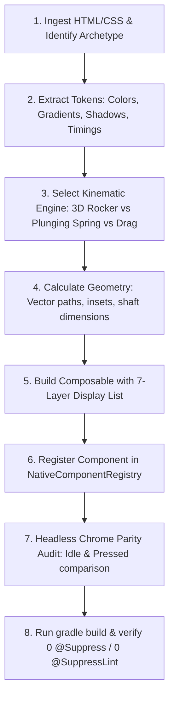
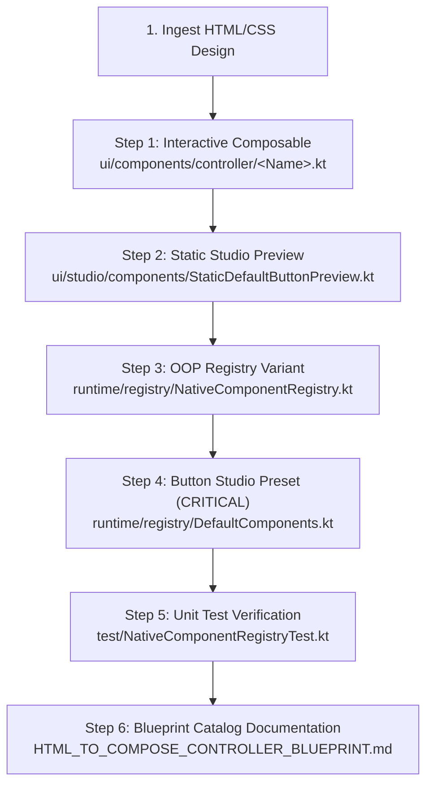

# NEXPAD — Universal HTML/CSS to Native Jetpack Compose Blueprint
## The Master Engineering Architecture for ANY Gamepad Control Archetype & Visual Style

This blueprint is NEXPAD's **universal conversion standard**. It covers the translation of **ANY** HTML/CSS controller button, joystick, trigger, bumper, or cluster—regardless of whether it is an optical lens, brushed metal, retro mechanical arcade, cybernetic neon, flat minimalist, or glassmorphic design.

---

## Table of Contents
1. [The 6 Controller Archetypes (Universal Classification)](#1-the-6-controller-archetypes-universal-classification)
2. [The 5 CSS Visual Design Styles & Compose Equivalents](#2-the-5-css-visual-design-styles--compose-equivalents)
3. [Universal CSS-to-Compose Property Mapping Matrix](#3-universal-css-to-compose-property-mapping-matrix)
4. [Kinematic Physics Engines (By Interaction Type)](#4-kinematic-physics-engines-by-interaction-type)
5. [Universal Touch, Drag & Hitbox Engine](#5-universal-touch-drag--hitbox-engine)
6. [The Universal 7-Layer Display List Pipeline](#6-the-universal-7-layer-display-list-pipeline)
7. [Step-by-Step Translation Algorithm for ANY Input HTML](#7-step-by-step-translation-algorithm-for-any-input-html)
8. [The Mandatory 6-Step End-to-End Component Wiring Pipeline (Button Studio Visibility)](#8-the-mandatory-6-step-end-to-end-component-wiring-pipeline-button-studio-visibility)
9. [Automated Verification Pipeline: Python, Headless Chrome & Tests](#9-automated-verification-pipeline-python-headless-chrome--tests)
10. [Zero-Tolerance Architecture & Android Quality Rules](#10-zero-tolerance-architecture--android-quality-rules)
11. [Native D-Pad Family Catalog (All 6 Implemented Variants)](#11-native-d-pad-family-catalog-all-6-implemented-variants)
12. [Native Shoulder Bumper Family Catalog](#12-native-shoulder-bumper-family-catalog)
13. [Native Analog Trigger Family Catalog](#13-native-analog-trigger-family-catalog)
14. [Native System Button Family Catalog (Optical Lens Suite: Back, Guide, Start, Share)](#14-native-system-button-family-catalog-optical-lens-suite-back-guide-start-share)
15. [Bespoke Controller Auras & Kinetic Bloom Architecture](#15-bespoke-controller-auras--kinetic-bloom-architecture)

---

## 1. The 6 Controller Archetypes (Universal Classification)

Every HTML/CSS controller component falls into one of these 6 archetypes. Identify the archetype first:

| Archetype | Canonical Key | HTML/CSS Signature | Native Compose Interaction Model |
|---|---|---|---|
| **Action Button** | `A`, `B`, `X`, `Y` | Circular/square button, `:active` translateY or scale | Linear plunging spring (`scale` 0.95 + `offsetY` 2-4dp) |
| **Directional Pad (D-Pad)** | `DPAD` (Cluster) | Cross/disc shape, SVG arms, multi-directional tilt | 3D Rocker pivot (`rotationX`/`rotationY` on center ball-joint) |
| **Analog Joystick** | `LS`, `RS` | Base socket + thumb cap, `transform: translate(dx, dy)` | 2D polar vector clamping (`hypot`, `atan2`), spring decay |
| **Shoulder Bumper** | `LB`, `RB` | Asymmetric pill/wedge, slight corner radius tilt | Pivot hinge plunge (`scale` 0.96 + `offsetY` 2dp, edge shadow) |
| **Analog Trigger** | `LT`, `RT` | Deep pedal/shoe shape, vertical translation travel | Progressive 1D travel (`offsetY` 4-8dp + depth compression) |
| **System Button** | `START`, `BACK`, `GUIDE`, `SHARE` | Small pill/circle, flush bezel, minimal travel | Tactile micro-snap (`scale` 0.92, quick 50ms snap) |

> [!IMPORTANT]
> **Cluster Rule**: When an HTML file defines a composite control (e.g. an entire D-Pad with 4 arms or an analog stick with socket + thumb cap), **NEVER split it into separate button variants**. Always build a single unified Composable mapped to the parent key (e.g., `ControlKey.DPAD`).

---

## 2. The 5 CSS Visual Design Styles & Compose Equivalents

Whatever visual art style the HTML uses, map it to these native rendering formulas:

### Style A: Optical Lens / Acrylic Dome (e.g. Lens Series)
- **Convex Dome**: Multi-stop `Brush.radialGradient` with off-center zenith: `Offset(w * 0.50f, h * 0.45f)`.
- **Recessed Undercut Shadow**: Vertical gradient `Transparent` → `Black.copy(0.70f)` over bottom 35%.
- **Recessed Inset Ribbon**: Contracted vector path (`insetDp`) with dual-pass stroke (halo bloom + filament).
- **Glass Specular Arc**: Top 180° crescent gradient (`Color.White.copy(0.14f)` → `Transparent`) + bottom-right sheen oval.

### Style B: Brushed Metal / Chamfered Industrial
- **Radial/Conic Bevel**: Conic gradient highlight/shadow pairs simulating 45° ambient lighting.
- **Chamfered Metallic Rim**: 1.5dp border with dual-tone gradient (`White.copy(0.40f)` at top-left, `Black.copy(0.60f)` at bottom-right).
- **Brushed Texture**: Repeating micro-lines or dash effects (`PathEffect.dashPathEffect(floatArrayOf(2f, 4f), 0f)`).

### Style C: Retro Mechanical Arcade / Chunky Switch
- **Hard Cast Shadow**: Solid black offset shadow without blur (`Modifier.offset(x = 0.dp, y = 6.dp)` on idle; collapses to `0.dp` on press).
- **Concave Dish Cap**: Radial gradient with darker center (`#1a1a1a`) transitioning to lighter rim (`#333333`).
- **Heavy Bevel Border**: 3dp–5dp solid border with crisp 90° corners or classic arcade bevel.

### Style D: Cyberpunk Neon / Laser Wireframe
- **Multi-Stage Emissive Bloom**: 3-tier stroke rendering:
  1. Outer atmospheric aura: 12dp stroke at alpha `0.15f`.
  2. Core glow bloom: 6dp stroke at alpha `0.45f`.
  3. Laser filament core: 2dp stroke at alpha `1.0f` (pure white or vibrant neon).
- **Chassis Bleed**: `Modifier.drawBehind { drawCircle(neonColor.copy(0.35f), radius + 10.dp) }`.

### Style E: Glassmorphism / Frosted Acrylic
- **Translucent Fill**: `Color(0xFFFFFF).copy(alpha = 0.08f)` over dark backgrounds.
- **Specular Border Gradient**: Linear gradient from `White.copy(0.30f)` (top-left) to `White.copy(0.05f)` (bottom-right).
- **Sub-surface Diffusion**: Inner soft glow using radial gradient with high blur spread.

---

## 3. Universal CSS-to-Compose Property Mapping Matrix

| CSS Property | Compose Native Implementation | Technical Formula / Key Nuance |
|---|---|---|
| `background: radial-gradient(circle at X% Y%, c1, c2, c3)` | `Brush.radialGradient(listOf(c1, c2, c3), center = Offset(w * X/100f, h * Y/100f), radius = R)` | Sets physical light source zenith |
| `box-shadow: 0 4px 10px rgba(0,0,0,0.6)` | `Modifier.shadow(elevation = 10.dp, shape = Shape)` | Outer drop shadow |
| `box-shadow: inset 0 -6px 9px rgba(0,0,0,0.7)` | `Canvas: drawRect(Brush.verticalGradient(Transparent, Black.copy(0.70f)), ...)` | Undercut elevation shadow |
| `border: Npx solid var(--color)` | `Modifier.border(N.dp, Brush or Color, Shape)` | Outer housing stroke |
| `filter: drop-shadow(0 0 4px var(--glow))` | `Canvas: drawPath(path, color.copy(0.7f), Stroke(width = core + 4.dp))` + core pass | Emissive symbol bloom |
| `transform: perspective(420px) rotateX(...) rotateY(...)` | `Modifier.graphicsLayer { rotationX = rx; rotationY = ry; cameraDistance = 8f * density }` | Physical 3D rocker tilt (no squish) |
| `transform: scale(0.95) translateY(3px)` | `Modifier.graphicsLayer { scaleX = s; scaleY = s }.offset { IntOffset(0, y.roundToPx()) }` | Plunging button actuator travel |
| `transition: transform 0.08s ease` | `animateFloatAsState(targetValue, tween(80, easing = FastOutSlowInEasing))` | Snappy mechanical snap |
| `transition: transform 0.18s cubic-bezier(.3,1.6,.5,1)` | `animateFloatAsState(targetValue, spring(dampingRatio = 0.68f, stiffness = 440f))` | Elastic spring rebound |
| `opacity: var(--val)` | `animateFloatAsState(targetValue, tween(100))` | Smooth color/fill illumination |

---

## 4. Kinematic Physics Engines (By Interaction Type)

### Engine 1: 3D Rocker Pivot (D-Pads, Directional Discs)
Real D-Pads are mounted on a central pivot ball. When pressed, the cross does **NOT shrink**. It rotates in 3D:
```kotlin
val rx by animateFloatAsState(
    targetValue = when {
        activeDirections.contains(DpadDirection.UP) -> 8f
        activeDirections.contains(DpadDirection.DOWN) -> -8f
        else -> 0f
    },
    animationSpec = tween(80, easing = FastOutSlowInEasing),
    label = "rx"
)
val ry by animateFloatAsState(
    targetValue = when {
        activeDirections.contains(DpadDirection.RIGHT) -> 8f
        activeDirections.contains(DpadDirection.LEFT) -> -8f
        else -> 0f
    },
    animationSpec = tween(80, easing = FastOutSlowInEasing),
    label = "ry"
)

Modifier.graphicsLayer {
    rotationX = rx
    rotationY = ry
    cameraDistance = 8f * density // Replicates perspective: 420px
}
```

### Engine 2: Damped Harmonic Spring (Action Buttons, Bumpers, Plungers)
Models physical button travel with spring resistance and tactile bottoming out:
```kotlin
val scaleAnim by animateFloatAsState(
    targetValue = if (isPressed) 0.95f else 1.0f,
    animationSpec = spring(dampingRatio = 0.68f, stiffness = 440f),
    label = "btn_scale"
)
val travelOffsetAnim by animateFloatAsState(
    targetValue = if (isPressed) 3.5f else 0f,
    animationSpec = spring(dampingRatio = 0.68f, stiffness = 440f),
    label = "btn_travel"
)

Modifier
    .graphicsLayer { scaleX = scaleAnim; scaleY = scaleAnim }
    .offset { IntOffset(0, travelOffsetAnim.dp.roundToPx()) }
```

### Engine 3: 2D Polar Clamping & Momentum Coasting (Analog Sticks)
Joysticks require boundary clamping and smooth recentering:
```kotlin
val dist = hypot(dx, dy)
val (clampedX, clampedY) = if (dist > maxRadius) {
    val angle = atan2(dy, dx)
    Pair(cos(angle) * maxRadius, sin(angle) * maxRadius)
} else {
    Pair(dx, dy)
}
// Deadzone filtering:
val normX = if (dist < deadzone) 0f else (clampedX / maxRadius).coerceIn(-1f, 1f)
val normY = if (dist < deadzone) 0f else (-clampedY / maxRadius).coerceIn(-1f, 1f)
```

---

## 5. Universal Touch, Drag & Hitbox Engine

### 1. The Cardinal Shaft Box Rule (Strict Single-Arm & Corner Voiding)
To match physical controllers and SVG hit rects, cross D-Pads must:
1. **Never trigger 2 buttons on diagonal taps**.
2. **Treat diagonal corners outside the cross arms as non-clickable voids**.
3. **Drop touches outside the physical arm boundary**.

```kotlin
fun resolveDpadHit(
    dx: Float, 
    dy: Float, 
    armHalfWidth: Float, 
    deadzone: Float, 
    armMaxReach: Float
): Set<DpadDirection> {
    val isUp = dy in (-armMaxReach)..(-deadzone) && abs(dx) <= armHalfWidth
    val isDown = dy in deadzone..armMaxReach && abs(dx) <= armHalfWidth
    val isLeft = dx in (-armMaxReach)..(-deadzone) && abs(dy) <= armHalfWidth
    val isRight = dx in deadzone..armMaxReach && abs(dy) <= armHalfWidth

    return when {
        // Overlap resolution (strictly single button):
        isUp && isRight -> if (abs(dy) >= abs(dx)) setOf(DpadDirection.UP) else setOf(DpadDirection.RIGHT)
        isUp && isLeft  -> if (abs(dy) >= abs(dx)) setOf(DpadDirection.UP) else setOf(DpadDirection.LEFT)
        isDown && isRight -> if (abs(dy) >= abs(dx)) setOf(DpadDirection.DOWN) else setOf(DpadDirection.RIGHT)
        isDown && isLeft  -> if (abs(dy) >= abs(dx)) setOf(DpadDirection.DOWN) else setOf(DpadDirection.LEFT)
        isUp -> setOf(DpadDirection.UP)
        isDown -> setOf(DpadDirection.DOWN)
        isLeft -> setOf(DpadDirection.LEFT)
        isRight -> setOf(DpadDirection.RIGHT)
        else -> emptySet() // Diagonal corner voids, center hub & out-of-bounds are non-clickable
    }
}
```

### 2. Multi-Touch Gestures for Buttons
For rapid button tapping with tactile haptic feedback:
```kotlin
Modifier.pointerInput(key) {
    detectTapGestures(
        onPress = {
            onVibrate()
            isPressed = true
            viewModel.updateButton(key, true)
            tryAwaitRelease()
            isPressed = false
            viewModel.updateButton(key, false)
        }
    )
}
```

---

## 6. The Universal 7-Layer Display List Pipeline

When writing the `Canvas` rendering code, always organize drawing calls in this canonical 7-layer order:

```
[Layer 7] Specular Optical Overlays (Non-moving glass reflection, top crescent, rim glints)
   ↑
[Layer 6] Active Emissive Bloom (Drop-shadow halos around labels, chevrons, or icons)
   ↑
[Layer 5] Core Glyphs & Graphics (Crisp white or neon text, vector paths, SVGs)
   ↑
[Layer 4] Tactile Textures & Insets (Grip ribs, knurled dashes, recessed neon channels)
   ↑
[Layer 3] Actuator Surface Dome (Convex/concave base gradient + bottom undercut shadow)
   ↑
[Layer 2] Bezel Socket / Housing (Recessed housing well, 1px metallic rim)
   ↑
[Layer 1] Ambient Chassis Bloom (Outer glowing halo cast onto controller body via drawBehind)
```

---

## 7. Step-by-Step Translation Algorithm for ANY Input HTML

Whenever the user provides HTML/CSS for ANY controller button:



1. **Classify Archetype**: Action Button, D-Pad, Joystick, Bumper, Trigger, or System button.
2. **Classify Style**: Optical Lens, Brushed Metal, Retro Arcade, Cyber Neon, or Glassmorphic.
3. **Select Physics Engine**:
   - D-Pad → 3D Rocker Pivot (`rotationX`/`rotationY`).
   - Button/Bumper/Trigger → Damped Harmonic Spring (`scale` + `offsetY`).
   - Stick → 2D Polar Clamping (`normX`/`normY`).
4. **Map Visual Layers**: Apply the 7-Layer Display List in `Canvas`.
5. **Implement Hitbox Engine**: Apply shaft-box filtering for multi-directional controls.
6. **Register Component**: Add to [`NativeComponentRegistry.kt`](file:///C:/Users/parma/OneDrive/Desktop/NEXPAD%20Project/NEXPAD/app/src/main/java/com/sanket/tools/nexpad/runtime/registry/NativeComponentRegistry.kt) using canonical `ControlKey`.

---

## 8. The Mandatory 6-Step End-to-End Component Wiring Pipeline (Button Studio Visibility)

> [!CAUTION]
> **Why components go missing in Button Studio**:
> Registering a component in `NativeComponentRegistry.kt` connects the runtime rendering engine, but **Button Studio will NOT display it in the grid** unless it is also registered in `DefaultComponents.kt` (`ALL_PRESETS`). Button Studio (`ButtonStudioScreen.kt`) and HUD Editor (`HudEditorViewModel.kt`) query `ComponentRegistry.installedComponents`, which loads presets directly from `DefaultComponents.ALL_PRESETS`.
> 
> **Every new component variant MUST complete all 6 steps below.**



### Step 1: Create Interactive Composable
- **Location**: `app/src/main/java/com/sanket/tools/nexpad/ui/components/controller/<Name>.kt`
- **Responsibilities**:
  1. **Canonical Signature**:
     ```kotlin
     @Composable
     fun <Name>(
         key: String,
         isConnected: Boolean,
         onVibrate: () -> Unit,
         viewModel: GamepadViewModel,
         isRgbEnabled: Boolean,
         modifier: Modifier = Modifier,
         displayLabel: String? = null
     )
     ```
  2. **Mobile Screen Sizing**:
     Always scale down from desktop HTML dimensions to smartphone controller proportions:
     - **Shoulder Bumpers**: `154.dp × 48.dp` or `154.dp × 56.dp`
     - **Action Buttons**: `60.dp × 60.dp` to `72.dp × 72.dp`
     - **D-Pads (Clusters)**: `150.dp × 150.dp` to `160.dp × 160.dp`
     - **Analog Joysticks**: `140.dp × 140.dp` to `150.dp × 150.dp`
     - **Analog Triggers**: `100.dp × 160.dp`
     - **System Buttons**: `52.dp × 52.dp` to `64.dp × 64.dp`
  3. **Kinematics & Feedback**:
     - Buttons/Bumpers: `animateFloatAsState(targetValue = if (isPressed) 0.96f else 1.0f, animationSpec = spring(dampingRatio = 0.68f, stiffness = 440f))`
     - Haptics: Call `onVibrate()` immediately on down-touch.
     - State Dispatch: `viewModel.updateButton(key, isPressed)`.
  4. **7-Layer Display List**: Organize drawing in `Canvas` following Section 6.

### Step 2: Create Static Studio Preview
- **Location**: `app/src/main/java/com/sanket/tools/nexpad/ui/studio/components/StaticDefaultButtonPreview.kt`
- **Responsibilities**:
  - Add `@Composable internal fun Static<Name>(key: String = ..., modifier: Modifier = Modifier)`.
  - Must have **100% visual parity** with the idle state of the interactive component.
  - Zero pointer gestures or mutable state (ensures 60 FPS smooth scrolling in Button Studio grid).

### Step 3: Register Native Element Variant in OOP Registry
- **Location**: `app/src/main/java/com/sanket/tools/nexpad/runtime/registry/NativeComponentRegistry.kt`
- **Responsibilities**:
  1. **Declare the BaseNativeVariant Object**:
     ```kotlin
     object <Name>Variant : BaseNativeVariant("builtin.<id>", ControlKey.<KEY>, "<Display Name>", <seedCode>) {
         override val isBaselineDefault: Boolean = false

         @Composable
         override fun RenderInteractive(context: NativeRenderContext) {
             <Name>(
                 key = K.<KEY>,
                 isConnected = context.isConnected,
                 onVibrate = context.onVibrate,
                 viewModel = context.viewModel,
                 isRgbEnabled = context.isRgbEnabled,
                 displayLabel = context.displayLabel,
                 modifier = context.modifier
             )
         }

         @Composable
         override fun RenderStaticPreview(context: NativePreviewContext) {
             Static<Name>(
                 key = context.displayLabel,
                 modifier = context.modifier
             )
         }
     }
     ```
  2. **Register in `DefaultNativeFamily.init`**:
     ```kotlin
     register(<Name>Variant)
     ```
  3. **Add Prefix to `isNativeBuiltin`**:
     ```kotlin
     id.startsWith("builtin.<prefix>_")
     ```

### Step 4: Register in Button Studio Catalog & Presets (MANDATORY FOR UI VISIBILITY)
- **Location**: `app/src/main/java/com/sanket/tools/nexpad/runtime/registry/DefaultComponents.kt`
- **Why this step is critical**: Button Studio (`ButtonStudioScreen.kt`) populates its browsing grid directly from `ComponentRegistry.installedComponents`, which loads `DefaultComponents.ALL_PRESETS`. Without this step, the component is registered in the engine but is completely invisible to users in Button Studio and HUD Editor!
- **Responsibilities**:
  1. **Define the `NxpComponentDef` Preset**:
     ```kotlin
     val <NAME> = NxpComponentDef(
         manifest = NxpManifest(
             id = "builtin.<id>",
             name = "<Display Name>",
             author = "NEXPAD Core",
             version = "1.0.0",
             category = NxprcCategory.<CATEGORY>.id,  // BUTTON, DPAD, BUMPER, TRIGGER, JOYSTICK, SYSTEM
             defaultControl = ControlKey.<KEY>.key,
             description = "<Description of style and kinematics>"
         ),
         geometry = NxpGeometry(type = "RoundedRect", cornerRadius = 24f),
         visual = NxpVisual(
             fillColor = "#26282B",
             opacity = 0.95f,
             borderColor = "#A97CF0",
             borderWidth = 2f,
             glowColor = "#A97CF0",
             glowRadius = 10f
         ),
         pressed = NxpPressedState(scale = 0.97f, fillColor = "#A97CF0"),
         label = NxpLabel(text = "<KEY>", color = "#A97CF0", pressedColor = "#FFFFFF", fontSize = 18f),
         size = NxpSize(widthDp = 154, heightDp = 56)
     )
     ```
  2. **Append to `ALL_PRESETS`**:
     ```kotlin
     val ALL_PRESETS = listOf(
         ...
         <NAME>,
     )
     ```

### Step 5: Add Unit Test Coverage
- **Location**: `app/src/test/java/com/sanket/tools/nexpad/NativeComponentRegistryTest.kt`
- **Responsibilities**:
  1. Add assertion to `testIsNativeBuiltin`:
     `assertTrue(NativeComponentRegistry.isNativeBuiltin("builtin.<id>"))`
  2. Add assertion to `testResolveVariantWithCustomIdAndFallback`:
     Verify resolution returns the variant with the assigned `<seedCode>`.
  3. Add assertion to `testResolveButtonSourceTypeAlwaysDefaultBadgeForNative`:
     Verify it maps to `ButtonStudioType.DEFAULT`.
  4. Add dedicated test `test<Name>VariantsRegistered()`:
     Verify variant name, control key, seed code, and non-baseline flag.

### Step 6: Update Blueprint Catalog
- **Location**: `docs/HTML_TO_COMPOSE_CONTROLLER_BLUEPRINT.md`
- **Responsibilities**:
  - Add a new row to the corresponding component catalog table with Component ID, Seed Code, and Key Signature.

---

## 9. Automated Verification Pipeline: Python, Headless Chrome & Tests

To ensure mathematical and visual 100% parity, execute this 3-tier testing pipeline:

### Tool 1: Headless Chrome Automation (HTML Ground Truth)
Capture exact ground-truth screenshots of the HTML file in both **Idle** and **Pressed/Active** states:

```powershell
# Capture HTML in Headless Chrome
$chrome = "C:\Program Files\Google\Chrome\Application\chrome.exe"
& $chrome --headless --disable-gpu --screenshot="html_idle.png" --window-size=500,500 "file:///path/to/component.html"
```
To capture the pressed state, inject a temporary `.pressed` class or `:active` trigger in the HTML before snapshotting.

### Tool 2: Python (Pillow) Side-by-Side Audit Card & Diff Generator
Use a Python script to crop the rendered buttons, align their centers, and generate side-by-side comparison cards:

```python
# audit_comparison.py
from PIL import Image, ImageDraw, ImageFont

def generate_comparison_card(html_img_path, native_img_path, output_card_path, title):
    img_html = Image.open(html_img_path).convert("RGBA")
    img_native = Image.open(native_img_path).convert("RGBA")
    
    # Standardize dimensions
    box_size = (300, 300)
    img_html = img_html.resize(box_size, Image.Resampling.LANCZOS)
    img_native = img_native.resize(box_size, Image.Resampling.LANCZOS)
    
    # Create dark comparison card
    card = Image.new("RGBA", (660, 380), (16, 17, 19, 255))
    draw = ImageDraw.Draw(card)
    
    # Title & Labels
    draw.text((24, 20), f"NEXPAD — {title}", fill=(255, 255, 255))
    draw.text((36, 60), "HTML / Chrome Reference", fill=(0, 229, 255))
    draw.text((360, 60), "Native Jetpack Compose", fill=(0, 255, 128))
    
    # Paste centered crops
    card.paste(img_html, (30, 90), img_html)
    card.paste(img_native, (350, 90), img_native)
    
    card.save(output_card_path, "PNG")
    print(f"Audit card saved to: {output_card_path}")

# Run via command line:
# python audit_comparison.py
```

### Tool 3: Automated Kotlin JVM Unit Testing (Hitbox & Touch Logic)
Verify all hitboxes, cardinal deadzones, diagonal rolling, and clamped boundaries using JVM unit tests without needing an Android device:

```kotlin
// Example: LensDPadTest.kt
package com.sanket.tools.nexpad

import org.junit.Assert.assertEquals
import org.junit.Assert.assertTrue
import org.junit.Test
import kotlin.math.hypot

class DPadHitboxTest {

    @Test
    fun `tapping cardinal up arm off-center does NOT trigger false diagonal`() {
        val shaftHalfWidth = 23f
        val deadzone = 14f
        val outerRadius = 78f

        // Touch at x=10 (off-center right), y=-45 (top arm)
        val dx = 10f
        val dy = -45f

        val result = resolveDpadHit(dx, dy, shaftHalfWidth, deadzone, outerRadius)
        assertEquals(setOf(DpadDirection.UP), result)
    }

    @Test
    fun `tapping hub deadzone triggers no directions`() {
        val dx = 5f
        val dy = 5f
        val result = resolveDpadHit(dx, dy, shaftHalfWidth = 23f, deadzone = 14f, outerRadius = 78f)
        assertTrue(result.isEmpty())
    }

    @Test
    fun `corner touch outside shaft in diagonal void registers no buttons`() {
        val dx = 35f
        val dy = -35f
        val result = resolveDpadHit(dx, dy, shaftHalfWidth = 23f, deadzone = 14f, outerRadius = 78f)
        assertTrue(result.isEmpty())
    }
}
```

---

## 10. Zero-Tolerance Architecture & Android Quality Rules

1. **Zero Suppression Rule**: Strictly **0 `@Suppress` and 0 `@SuppressLint`** across all of `app/src/`.
2. **Modern API Gates**: Always gate API-dependent features using `Build.VERSION.SDK_INT` without deprecated fallbacks.
3. **Type-Safe System Services**: Use `context.getSystemService(VibratorManager::class.java)` instead of string casting.
4. **Performance**: Avoid allocations inside `Canvas { ... }` or `drawBehind { ... }`. Always pre-calculate brushes, paths, and gradients outside draw loops using `remember`.
5. **Resolution Independence**: Always scale dimensions with `.dp.toPx()` and use `LocalDensity.current` so components scale identically across all screen DPIs.
6. **Continuous Gradle Verification**: Run `.\gradlew.bat compileDebugKotlin testDebugUnitTest` and `git grep -n -E "@(Suppress|SuppressLint)" app/src/` to verify 100% clean builds.

---

## 11. Native D-Pad Family Catalog (All 6 Implemented Variants)

| Variant Name | Component ID | Seed Code | Key Visual & Kinematic Signature |
|---|---|---|---|
| **Lens Cross** | `builtin.lens_dpad` | `4101` | Full contoured cross, 3D rocker tilt, directional chevrons, inset ribbon, and specular lens arc. |
| **Four Lenses** | `builtin.four_lenses_dpad` | `4102` | Four discrete circular optical lens keys orbiting a central stationary hub with 3D rocker tilt. |
| **Lens Disc** | `builtin.disc_dpad` | `4103` | Concentric grooved circular disc, 3D rocker tilt, directional gate sweep, and central sliding puck. |
| **Lens Capsules** | `builtin.capsules_dpad` | `4104` | Four discrete rounded pill capsule keys orbiting a central pivot hub with 3D rocker tilt. |
| **Lens Metaballs** | `builtin.metaballs_dpad` | `4105` | Organic fluid metaballs layer connecting central fluid orb to four satellite nodes with spring retraction. |
| **Lens Rails** | `builtin.rails_dpad` | `4106` | Orthogonal recessed guide rails, 40dp sliding tactile puck (52dp travel), animated extending light beams, and 4 end LEDs. |

---

## 12. Native Shoulder Bumper Family Catalog

| Variant Name | Component ID | Seed Code | Key Visual & Kinematic Signature |
|---|---|---|---|
| **Realistic 3D Bumper** | `builtin.default_lb` / `builtin.default_rb` | `3001` / `3002` | Asymmetric ergonomic contour (10dp outer screen bezel, 26dp inner slope), 78dp×30dp magnifier window well, 7-layer optical lens with neon ring bloom & bottom undercut shadow. |
| **Arc Bumper (Bumper A)** | `builtin.arc_lb` / `builtin.arc_rb` | `3101` / `3102` | Quadratic curved bridge contour (`M24 62 Q115 -10 206 62`), 154dp×56dp mobile controller ratio, thickened 46-unit tubular body (`#282a2e -> #08090a`), multi-pass emissive neon halo (`#a97cf0`), apex-centered bold glyph (`y = -10.5dp` offset) for high LB/L1 contrast, top specular highlight crescent, plunging spring travel (`translateY 2px, scale 0.97`). |
| **LED Bar Bumper (Bumper B)** | `builtin.led_lb` / `builtin.led_rb` | `3201` / `3202` | Flipped mobile ergonomic contour (12dp outer screen bezel, 27dp inner slope), 154dp×54dp mobile ratio, recessed optical window (`48dp × 28dp`), 6-segment illuminated neon LED bar graph with permanent ambient neon glow aura and cascading wave animation on press (35ms stagger), top specular crescent highlight, plunging spring travel (`translateY 2px, scale 0.96`). |
| **Peek Bumper (Bumper C)** | `builtin.peek_lb` / `builtin.peek_rb` | `3301` / `3302` | Symmetrical pill capsule contour (27dp radius), 154dp×54dp mobile ratio, oversized recessed optical magnifier aperture window (`124dp × 36dp`), framed bold peek glyph (`22sp`, `3sp` tracking in idle, 2.0x dynamic zoom expansion to `44sp` on press), plunging spring travel (`translateY 2px, scale 0.95`). |
| **Ribbed Bumper (Bumper D)** | `builtin.rib_lb` / `builtin.rib_rb` | `3401` / `3402` | Mobile ergonomic contour (12dp outer screen bezel, 27dp inner slope), 154dp×54dp mobile ratio, tactile repeating vertical micro-rib knurling (2px rib every 8px), elevated optical window (`74dp × 30dp` at top 42%), lower illuminated neon lightbar accent strip (`110dp × 4dp` at bottom 9dp) igniting on press, plunging spring travel (`translateY 2px, scale 0.95`). |
| **Underglow Bumper (Bumper E)** | `builtin.under_lb` / `builtin.under_rb` | `3501` / `3502` | Mobile ergonomic contour (12dp top outer corner, 14dp top inner, 27dp aerodynamic bottom hull), 154dp×54dp mobile ratio, bottom neon underglow ground bar (3dp thick, 12dp margin) emitting radiant downward floor bloom, dynamic upward neon surge flood illumination (0% to 100% height) on press, centered bold glyph (`24sp`), plunging spring travel (`translateY 2px, scale 0.95`). |
| **Tube Bumper (Bumper F)** | `builtin.tube_lb` / `builtin.tube_rb` | `3601` / `3602` | Cylindrical tube pill contour (27dp radius), 154dp×54dp mobile ratio, dynamic illuminated liquid level surging horizontally (0% to 100% width) with meniscus wave front on press, laboratory calibration ruler tick marks along bottom (1dp tick every 10dp), recessed optical window (`74dp × 28dp`), plunging spring travel (`translateY 2px, scale 0.95`). |
| **Flip Bumper (Bumper G)** | `builtin.flip_lb` / `builtin.flip_rb` | `3701` / `3702` | Symmetrical pill contour (27dp radius), 154dp×54dp mobile ratio, 3D card flip kinematics along horizontal X axis (0° to 180°), transitioning from Face A (resting dark dome with 96dp×32dp optical window) to Face B (active high-energy golden radiant neon plate with embossed dark tactical typography #0A0B0C). |

---

## 13. Native Analog Trigger Family Catalog

| Variant Name | Component ID | Seed Code | Key Visual & Kinematic Signature |
|---|---|---|---|
| **Realistic Analog Trigger (Trigger A)** | `builtin.default_lt` / `builtin.default_rt` | `2001` / `2002` | Balanced mobile trigger contour (flipped upside down: $16\text{dp}$ top corners sitting flush below bumpers, $46\text{dp}$ semicircular bottom pedal hull), perfectly proportioned $100\text{dp} \times 92\text{dp}$ mobile ratio, progressive analog fluid meter (`.lx-meter`, $7\text{dp}$ inset) surging upward from bottom hull on press ($0\%$ to $100\%$ vertical travel) with top emissive crest bloom, recessed optical window (`.lx-window`, $68\text{dp} \times 30\text{dp}$, $r=15\text{dp}$ positioned at top offset $12\text{dp}$), bold medium typography ($18\text{sp}$, $1.5\text{sp}$ tracking), multi-pass neon lens ring (`.lx-ring`), top specular line highlight (`.lx-lens`), plunging spring travel (`translateY 2px, scale 0.95`). Excludes percentage readout text per design directive. |
| **Dial Gauge Trigger (Trigger B)** | `builtin.dial_lt` / `builtin.dial_rt` | `2101` / `2102` | Pure optical radial gauge trigger: circular $92\text{dp} \times 92\text{dp}$ compact mobile standard (matching low $92\text{dp}$ vertical profile beneath bumpers), 270° radial gauge track (`StrokeCap.Round`, starting at $135^\circ$ South-West and sweeping clockwise to $45^\circ$ South-East leaving bottom $90^\circ$ gap), dynamic active surging neon gauge arc ($0\%$ to $100\%$ fill travel) with emissive halo bloom, recessed optical window (`.lx-window`, $48\text{dp} \times 26\text{dp}$, $r=13\text{dp}$ at center Y $-2\text{dp}$), bold tactical typography ($17\text{sp}$, $1.5\text{sp}$ tracking), multi-pass neon lens ring (`.lx-ring`), top specular crescent arc highlight (`.lx-lens`), and plunging spring travel (`translateY 2px, scale 0.95`). Excludes percentage readout text per design directive. |
| **Liquid Orb Trigger (Trigger C)** | `builtin.liquid_lt` / `builtin.liquid_rt` | `2201` / `2202` | Fluid-filled spherical glass orb trigger: circular $92\text{dp} \times 92\text{dp}$ compact mobile standard (matching low $92\text{dp}$ vertical profile beneath bumpers), recessed spherical fluid chamber (`.liq-wrap`, $7\text{dp}$ inset), progressive rising neon liquid level ($14\%$ ambient baseline to max $80\%$ full on press so the liquid surface remains visibly defined) with dual-layer radiant fluid volume gradient, dynamic swaying fluid meniscus crest (`.liq::before`, $700\text{ms}$ harmonic rocking cycle while held) with core neon glow oval and specular wave crest glint, elevated recessed optical window (`.lx-window`, $48\text{dp} \times 26\text{dp}$, $r=13\text{dp}$ at top $34\%$ position), bold tactical typography ($17\text{sp}$, $1.5\text{sp}$ tracking), multi-pass neon lens ring (`.lx-ring`), top specular crescent arc highlight (`.lx-lens`), and plunging spring travel (`translateY 2px, scale 0.95`). Excludes percentage readout text per design directive. |
| **VU Slabs Trigger (Trigger D)** | `builtin.vu_lt` / `builtin.vu_rt` | `2301` / `2302` | Seven-slab progressive LED audio meter trigger: balanced mobile trigger contour (Option D: balanced $22\text{dp}$ top corners, $34\text{dp}$ bottom pedal hull eliminating heavy bulging), proportioned $100\text{dp} \times 92\text{dp}$ mobile ratio, 7 audio meter LED slabs stacked vertically from bottom hull upward ($54\text{dp}$ to $72\text{dp}$ graceful taper widths, $4\text{dp}$ height, $2.5\text{dp}$ gap), progressive ignition curve ($\text{clamp}(0.13, (\text{fill} - i \times 0.143) \times 16, 1.0)$: dim $13\%$ idle ghosting rising to $100\%$ full neon bloom on pull), dual overdrive tiers (slabs 0–4: base neon green `#3FD25A` on LT / hot magenta `#E055B8` on RT; slab 5: warning hot amber `#FF8A3D`; slab 6: peak overdrive crimson `#FF5A4D`), recessed optical window (`.lx-window`, $54\text{dp} \times 24\text{dp}$, $r=12\text{dp}$ at top offset $10\text{dp}$), bold tactical typography ($15\text{sp}$, $1.5\text{sp}$ tracking), true geometry Path-rendered neon lens ring (`.lx-ring`), top specular crescent highlight (`.lx-lens`), and plunging spring travel (`translateY 2px, scale 0.95`). Excludes percentage readout text per design directive. |
| **Target Trigger (Trigger E)** | `builtin.target_lt` / `builtin.target_rt` | `2401` / `2402` | Concentric circular radar target trigger: circular $92\text{dp} \times 92\text{dp}$ compact mobile standard (`CircleShape`, matching uniform $92\text{dp}$ vertical clearance below shoulder bumpers), 3 concentric illuminated target rings stacked at $74\text{dp}, 56\text{dp}, 38\text{dp}$ diameters ($37\text{dp}, 28\text{dp}, 19\text{dp}$ radii), progressive outside-in lighting curve ($\text{clamp}(0.14, (\text{fill} - i \times 0.30) \times 12, 1.0)$: dim $14\%$ ghost ring visibility in idle, igniting into full neon bloom with dual-layer filament glow on pull; Ring 0 outer ignites at $0.0$–$0.1$, Ring 1 middle at $0.3$–$0.4$, Ring 2 inner at $0.6$–$0.7$), central optical eye window ($32\text{dp} \times 32\text{dp}$, `CircleShape`) with circular vignette, reactive dynamic glyph brightening ($0.45 + \text{fill} \times 0.55$, $14\text{sp}$ bold), multi-pass chassis ring with top specular crescent arc highlight (`.lx-lens`), and plunging spring travel (`translateY 2px, scale 0.95`). Excludes percentage readout text per design directive. |
| **Analog Slider Trigger (Trigger F)** | `builtin.slider_lt` / `builtin.slider_rt` | `2501` / `2502` | Continuous $0 \dots 255$ analog slider trigger designed for physical trigger clips & analog throttle/brake precision: compact ergonomic pill contour ($42\text{dp} \times 94\text{dp}$, $r=21\text{dp}$, scaled $45\%$ smaller for balanced mobile ergonomics), custom height scaling ($0.6\times \dots 2.2\times$) and toggleable pull direction ("Top $\to$ Down" default vs "Bottom $\to$ Top" flipped) in HUD Inspector, $5\text{dp}$ recessed track groove with dynamic illuminated neon fill beam, $26\text{dp}$ sliding optical puck handle with dual-layer neon filament ring and central luminous LED dot, real-time continuous $0.0 \dots 1.0$ dispatching directly into NexpadProtocol ($0 \dots 255$ byte over wire via UDP), damped harmonic spring return to $0.0$ broadcasting decay trajectory, recessed optical window ($30\text{dp} \times 14\text{dp}$, $r=7\text{dp}$) with radial vignette, bold tactical typography ($11\text{sp}$ bold), top specular crescent highlight, and multi-pass chassis neon ring bloom. Excludes numeric percentage readout text per design directive. |
| **Needle Meter Trigger (Trigger G)** | `builtin.needle_lt` / `builtin.needle_rt` | `2601` / `2602` | Arched analog meter trigger with swinging needle: standard trigger press kinematics via `detectTapGestures` & `updateButton(key, true/false)`, arched dome contour ($108\text{dp} \times 94\text{dp}$, top $r=54\text{dp}$, bottom $r=14\text{dp}$), radial graduation ticks arc and background track ($200^\circ \dots 340^\circ$, $140^\circ$ span), dynamic surging neon progress arc, swinging analog needle blade rotating from $-70^\circ$ to $+70^\circ$ around a central capped hub with glowing LED dot, recessed optical window ($48\text{dp} \times 20\text{dp}$, $r=10\text{dp}$) with tactical typography ($12\text{sp}$ bold), damped harmonic spring kinematics (`translateY 2px, scale 0.95`), top specular crescent highlight, and chassis neon ring bloom. Mint green (`#5CF29A`) on LT / Coral pink (`#FF5C8A`) on RT. Excludes percentage readout text per design directive. |
| **Test Tube Trigger (Trigger H)** | `builtin.testtube_lt` / `builtin.testtube_rt` | `2701` / `2702` | Cylindrical glass test tube trigger with rising liquid & bubbles: standard trigger press kinematics via `detectTapGestures` & `updateButton(key, true/false)`, compact capsule contour ($48\text{dp} \times 98\text{dp}$, $r=24\text{dp}$), recessed dark glass chamber, dynamic rising liquid volume with swaying liquid meniscus crest ($700\text{ms}$ harmonic rocking cycle while held), 5 rising bubbles floating up through the liquid column, volumetric measurement graduation scale ticks along right edge, specular vertical gloss strip along left edge, elevated optical window ($32\text{dp} \times 16\text{dp}$, $r=8\text{dp}$) near top, damped harmonic spring kinematics (`translateY 2px, scale 0.95`), and chassis neon ring bloom. Amber orange (`#FF9F43`) on LT / Violet purple (`#BD5CFF`) on RT. Excludes percentage readout text per design directive. |
| **Bloom Trigger (Trigger I)** | `builtin.bloom_lt` / `builtin.bloom_rt` | `2801` / `2802` | Expanding radial light bloom trigger: standard trigger press kinematics via `detectTapGestures` & `updateButton(key, true/false)`, circular $92\text{dp} \times 92\text{dp}$ compact mobile standard (`CircleShape`), central dark pupil core emitting an expanding radial bloom of radiant white/neon light as trigger is pressed ($0 \dots 42\text{dp}$ bloom radius), expanding bright circular bloom rim halo ($0 \dots 74\text{dp}$ diameter), central circular recessed optical eye window ($34\text{dp} \times 34\text{dp}$, `CircleShape`) with edge vignette and tactical glyph ($12\text{sp}$ bold), damped harmonic spring kinematics (`translateY 2px, scale 0.95`), top specular crescent arc highlight, and chassis neon ring bloom. Electric periwinkle (`#7C9CFF`) on LT / Neon rose (`#FF6584`) on RT. Excludes percentage readout text per design directive. |

---

## 14. Native System Button Family Catalog (Optical Lens Suite: Back, Guide, Start, Share)

The NEXPAD System Button suite translates the authentic **Optical Lens System HTML/CSS blueprint** into high-performance, resolution-independent Jetpack Compose components. While the original HTML specification demonstrated 3 buttons (`back`, `home`, `start`), NEXPAD provides complete coverage for modern 4-button console clusters (`Back/View`, `Home/Guide`, `Start/Menu`, and `Share/Capture`).

### 14.1 The 4 Canonical System Controls

| Button | Key & Seed | HTML Spec | Dimensions | Default Palette | Vector Icon Geometry ($24 \times 24$ Space) |
|---|---|---|---|---|---|
| **Back / View** | `ControlKey.BACK`<br>Seed `5003`<br>`builtin.default_view` | `.lx-sys`<br>`data-key="back"` | $60\text{dp} \times 60\text{dp}$ | `#D8DEE9`<br>(Silver-White) | **Overlapping Windows**:<br>• Front Rect: $x=4, y=8, w=12, h=12, r=2.5$<br>• Back Path: `M8 4.5h9.5A2.5 2.5 0 0 1 20 7v9.5`<br>• Stroke: $2.4\text{dp}$, `StrokeCap.Round`, `StrokeJoin.Round` |
| **Home / Guide** | `ControlKey.GUIDE`<br>Seed `5001`<br>`builtin.default_home` | `.lx-home`<br>`data-key="home"` | $74\text{dp} \times 74\text{dp}$<br>(Focal Nexus) | `#F0F3F8`<br>(`#00E5FF` in RGB) | **Nexus Concentric Core**:<br>• Outer Circle: $c=(12, 12), r=8.5$, stroke $3.2\text{dp}$<br>• Core Solid Dot: $c=(12, 12), r=3.0$, filled<br>• Inset Telemetry Ring (`.lx-ring2`): $r = R - 12\text{dp}$ |
| **Start / Menu** | `ControlKey.START`<br>Seed `5002`<br>`builtin.default_menu` | `.lx-sys`<br>`data-key="start"` | $60\text{dp} \times 60\text{dp}$ | `#D8DEE9`<br>(Silver-White) | **Hamburger Triple Bars**:<br>• Top Bar: $(5, 7) \to (19, 7)$<br>• Middle Bar: $(5, 12) \to (19, 12)$<br>• Bottom Bar: $(5, 17) \to (19, 17)$<br>• Stroke: $2.6\text{dp}$, `StrokeCap.Round` |
| **Share / Capture** | `ControlKey.SHARE`<br>Seed `5004`<br>`builtin.default_share` | Extended<br>Standard | $60\text{dp} \times 60\text{dp}$ | `#D8DEE9`<br>(Silver-White) | **Console Capture Tray + Upload Arrow**:<br>• Tray: `M5 14v3.5a2 2 0 0 0 2 2h10a2 2 0 0 0 2-2v-3.5`<br>• Shaft: $(12, 15) \to (12, 4.5)$<br>• Arrowhead: `M7.5 9L12 4.5l4.5 4.5`<br>• Stroke: $2.4\text{dp}$, `StrokeCap.Round` |

---

### 14.2 Universal Lens CSS-to-Compose Property Pipeline

| CSS Layer & Selector | CSS Property Specification | Native Compose Implementation Formula |
|---|---|---|
| **Plunging Kinematics**<br>`.lx.pressed .lx-body` | `transform: translateY(2px) scale(0.95);` | `animateFloatAsState(if (pressed) 2f else 0f, spring(0.68f, 440f))` & `scale(0.95f)` |
| **Acrylic Convex Dome**<br>`.lx-body` | `radial-gradient(circle at 50% 55%, #232527 0%, #0c0d0e 75%, #000 100%)` | `Brush.radialGradient(listOf(Color(0xFF232527), Color(0xFF0C0D0E), Color.Black), center = Offset(0.50f, 0.55f))` |
| **Recessed Undercut**<br>`.lx-body::box-shadow` | `inset 0 -6px 9px rgba(0,0,0,0.70)` | `drawRect(Brush.verticalGradient(Transparent, Black.copy(0.70f)), startY = h * 0.62f, endY = h)` |
| **Emissive Neon Ring**<br>`.lx-ring` | `inset: 3px; border: 2px solid var(--glow); box-shadow: 0 0 6px 1px, inset 0 0 6px` | Dual-pass Canvas circle at $r - 3\text{dp}$:<br>1. Halo Bloom: `Stroke(4.dp)`, $\alpha = 0.30 \to 0.60$<br>2. Core Line: `Stroke(2.dp)`, $\alpha = 0.70 \to 1.00$ |
| **Guide Secondary Ring**<br>`.lx-home .lx-ring2` | `inset: 14px; border: 1px solid var(--glow); opacity: 0.3; (pressed: 0.7)` | Single Canvas circle at $r - 12\text{dp}$ with `Stroke(1.dp)`, $\alpha = 0.30 \to 0.70$ (Guide only) |
| **Optical Specular Arc**<br>`.lx-lens` | `radial-gradient(circle at 70% 78%, rgba(255,255,255,0.06), transparent)` | Top 180° crescent: `drawArc(White.copy(0.16f) -> Transparent, 180f, 180f, Stroke(1.2.dp))` |
| **Lens Sheen Reflection**<br>`.lx-lens::after` | Specular ambient highlight | `drawOval(Brush.radialGradient(White.copy(0.07f), Transparent), center = Offset(0.70f, 0.78f))` |

---

### 14.3 High-Precision Vector Icon Engine (`drawSystemIcon`)

To ensure flawless resolution independence across any DPI and eradicate pixelation from static raster assets, all system button icons are rendered via native Compose `DrawScope` geometry scaled to $24 \times 24$ normalized coordinate units:

```kotlin
internal fun DrawScope.drawSystemIcon(
    controlKey: ControlKey?,
    color: Color,
    iconSizePx: Float,
    center: Offset
) {
    val scale = iconSizePx / 24f
    val left = center.x - iconSizePx / 2f
    val top = center.y - iconSizePx / 2f

    when (controlKey) {
        ControlKey.BACK -> {
            val strokeStyle = Stroke(width = 2.4f * scale, cap = StrokeCap.Round, join = StrokeJoin.Round)
            // Foreground rounded rectangle
            drawRoundRect(
                color = color,
                topLeft = Offset(left + 4f * scale, top + 8f * scale),
                size = Size(12f * scale, 12f * scale),
                cornerRadius = CornerRadius(2.5f * scale, 2.5f * scale),
                style = strokeStyle
            )
            // Background open rectangle path
            val backPath = Path().apply {
                moveTo(left + 8f * scale, top + 4.5f * scale)
                lineTo(left + 17.5f * scale, top + 4.5f * scale)
                quadraticTo(left + 20f * scale, top + 4.5f * scale, left + 20f * scale, top + 7f * scale)
                lineTo(left + 20f * scale, top + 16.5f * scale)
            }
            drawPath(path = backPath, color = color, style = strokeStyle)
        }

        ControlKey.GUIDE -> {
            // Outer concentric circle ring
            drawCircle(color = color, radius = 8.5f * scale, center = center, style = Stroke(width = 3.2f * scale))
            // Inner solid core nexus dot
            drawCircle(color = color, radius = 3.0f * scale, center = center)
        }

        ControlKey.START -> {
            val strokeW = 2.6f * scale
            val x1 = left + 5f * scale
            val x2 = left + 19f * scale
            drawLine(color, Offset(x1, top + 7f * scale), Offset(x2, top + 7f * scale), strokeWidth = strokeW, cap = StrokeCap.Round)
            drawLine(color, Offset(x1, top + 12f * scale), Offset(x2, top + 12f * scale), strokeWidth = strokeW, cap = StrokeCap.Round)
            drawLine(color, Offset(x1, top + 17f * scale), Offset(x2, top + 17f * scale), strokeWidth = strokeW, cap = StrokeCap.Round)
        }

        ControlKey.SHARE -> {
            val strokeStyle = Stroke(width = 2.4f * scale, cap = StrokeCap.Round, join = StrokeJoin.Round)
            // Bottom capture tray
            val trayPath = Path().apply {
                moveTo(left + 5f * scale, top + 14f * scale)
                lineTo(left + 5f * scale, top + 17.5f * scale)
                quadraticTo(left + 5f * scale, top + 19.5f * scale, left + 7f * scale, top + 19.5f * scale)
                lineTo(left + 17f * scale, top + 19.5f * scale)
                quadraticTo(left + 19f * scale, top + 19.5f * scale, left + 19f * scale, top + 17.5f * scale)
                lineTo(left + 19f * scale, top + 14f * scale)
            }
            drawPath(path = trayPath, color = color, style = strokeStyle)
            // Upward arrow stem & chevron arrowhead
            drawLine(color, Offset(center.x, top + 15f * scale), Offset(center.x, top + 4.5f * scale), 2.4f * scale, StrokeCap.Round)
            val arrowHead = Path().apply {
                moveTo(left + 7.5f * scale, top + 9f * scale)
                lineTo(center.x, top + 4.5f * scale)
                lineTo(left + 16.5f * scale, top + 9f * scale)
            }
            drawPath(path = arrowHead, color = color, style = strokeStyle)
        }

        else -> {
            drawCircle(color = color, radius = 4f * scale, center = center)
        }
    }
}
```

---

## 15. Bespoke Controller Auras & Kinetic Bloom Architecture

### 15.1 Philosophy & Architectural Rationale

Prior generations of gamepad UI utilized generic drop shadows (`Modifier.shadow`) or uniform circular radial gradients. While functional, these lacked physical authenticity and failed to express the mechanical or optical theme of each unique controller component.

In NEXPAD's **Bespoke Aura Architecture**, every controller component features a customized outer `.drawBehind` canvas effect mathematically derived from its interaction kinematics (press depth, stick deflection vector, analog trigger travel, or capacitive touch coordinates).

```
 ┌──────────────────────────────────────────────────────────────┐
 │                  NEXPAD 7-Layer Display List                  │
 │                                                              │
 │   Layer 0: .drawBehind { ... } Bespoke Kinetic Aura          │ ◄── THIS SYSTEM
 │   Layer 1: Component Chassis (Dark Acrylic / Anodized Metal) │
 │   Layer 2: Tactile Knurling, Laser Ticks, or Grooves         │
 │   Layer 3: Dynamic Fill / Progress / Needle / Fluid Layer    │
 │   Layer 4: Recessed Optical Window / Aperture                │
 │   Layer 5: Tactical Typography / Center Glyphs               │
 │   Layer 6: Top Specular Glass Crescent / Lens Reflection     │
 └──────────────────────────────────────────────────────────────┘
```

#### Why `.drawBehind`?
1. **Zero Layout Thrash**: `.drawBehind` executes directly on the graphics render layer behind the component, without triggering separate measure/layout passes.
2. **Hitbox Isolation**: Drawing outside the bounding box via `.drawBehind` does not expand or distort the touch target hitbox.
3. **Continuous Kinetic Access**: Draw passes have direct read access to dynamic animated state variables (`fillProgress`, `flipAngle`, `animOffsetX`, `touchX`, `touchY`) at 120 FPS.
4. **Zero Clipping Guarantee**: By sizing the outer gradient radius to $0.55\times \dots 1.0\times$ component dimensions and anchoring the outermost color stop strictly at `Color.Transparent`, radiant blooms blend seamlessly into the background canvas without sharp edges.

---

### 15.2 Kinematic Modulation Mathematical Models

#### Model A: Damped Harmonic Spring Alpha Modulation (Digital Press)
Digital face buttons, D-pad arms, and tactile switches animate their baseline emissive aura using underdamped harmonic spring physics:

$$\alpha_{\text{bloom}}(t) = \text{Spring}\left(\text{target} = \begin{cases} 0.95 & \text{if pressed} \\ 0.45 & \text{if idle} \end{cases}, \; k = 440\,\text{N/m}, \; \zeta = 0.68\right)$$

#### Model B: 2D Polar Deflection Modulation (Joysticks)
Analog stick auras modulate beam width, projection length, and radial intensity based on the normalized polar vector:

$$\mathbf{v} = (x, y), \quad r = \|\mathbf{v}\| = \sqrt{x^2 + y^2}, \quad f_{\text{def}} = \text{clamp}\left(\frac{r}{r_{\text{max}}}, 0.0, 1.0\right)$$

$$\theta_{\text{beam}} = \text{atan2}(y, x) \times \frac{180}{\pi}$$

$$\text{Cone Spread} = 50^\circ - 15^\circ \times f_{\text{def}}, \quad L_{\text{beam}} = D_{\text{min}} \times (0.55 + 0.25 \times f_{\text{def}})$$

As deflection increases, the beam tightens into a focused spotlight and elongates outward in real-time.

#### Model C: 3D Anamorphic Squashing & Horizon Laser Edge (Flip Kinematics)
Components that rotate in 3D space (`FlipButton`, `FlipBumper`) modulate their outer aura dimensions using projective cosine geometry:

$$f_{\cos} = \left|\cos\left(\theta_{\text{flip}} \times \frac{\pi}{180}\right)\right|$$

$$W_{\text{aura}} = (W_0 \times 1.15) \times \max(f_{\cos}, 0.08)$$

$$\text{Slit Intensity} = \begin{cases} \left(1.0 - \frac{f_{\cos}}{0.38}\right) \times \alpha_{\text{bloom}} & \text{if } f_{\cos} < 0.38 \\ 0.0 & \text{otherwise} \end{cases}$$

At $\theta_{\text{flip}} \approx 90^\circ$ (edge-on view), the broad circular aura collapses into an intense, laser-thin horizon blade.

#### Model D: Continuous Multi-Tier Overdrive Shift (VU Slabs & Gauges)
Analog triggers dynamically transition their aura color through 3 distinct spectral tiers:

$$\mathbf{C}_{\text{aura}}(f) = \begin{cases} \mathbf{C}_{\text{crimson}} (\text{Peak Clipping}) & \text{if } f > 0.85 \\ \mathbf{C}_{\text{amber}} (\text{Warning Overdrive}) & \text{if } f > 0.60 \\ \mathbf{C}_{\text{neon}} (\text{Nominal Operating}) & \text{otherwise} \end{cases}$$

#### Model E: Dynamic Capacitive Contact Waveform (Touchpads)
Touchpads emit dynamic capacitive waves positioned directly at the active finger contact coordinates $\mathbf{p}_{\text{touch}} = (x_t, y_t)$, rather than the geometric center:

$$\mathbf{C}(x, y) = \text{RadialGradient}\left(\text{center} = \mathbf{p}_{\text{touch}}, \; r = 46\,\text{dp}, \; \text{stops} = [1.0 \to \text{White}, 0.7 \to \mathbf{C}_{\text{aura}}, 0.0 \to \text{Transparent}]\right)$$

---

### 15.3 Master Catalog: The Complete 41-Component Themed Aura Matrix

#### Cluster 1: Face Buttons (8/8)

| Component | Archetype | Visual Aura Theme | Mathematical Formulation & Kinetic Behavior |
|---|---|---|---|
| **EclipseButton** | Face Button | Asymmetric Solar Penumbra + Diamond Corona Flare | Penumbra center shifts opposite to moon slide: $\mathbf{c}_p = \mathbf{c} - 0.55 \cdot \mathbf{d}_{\text{slide}}$. Ignites 4-point diamond starburst flare with annular limb halo on press. |
| **OrbitButton** | Face Button | Dual Counter-Rotating Dashed Orbits + Satellite Pips | Two concentric dashed planetary rings ($r_1 = r - 8\text{dp}, r_2 = r - 14\text{dp}$) counter-rotating by $+120^\circ$ and $-120^\circ$ under spring dynamics with satellite pips. |
| **RippleButton** | Face Button | Staggered 3-Wave Acoustic Shockwaves | 3 concentric rings launched on press staggered by $140\text{ms}$ delay. Each ring scales $1.0\times \to 1.9\times$ while alpha decays $0.85 \to 0.0$ over $800\text{ms}$. |
| **FlipButton** | Face Button | 3D Anamorphic Squashed Oval + Horizon Slit | Anamorphic horizontal oval squashing via $W = 1.15 \cdot W_0 \cdot |\cos(\theta)|$. Ignites high-intensity vertical laser slit blade when $|\cos(\theta)| < 0.38$. |
| **FacetButton** | Face Button | 8-Point Crystalline Diffraction Starburst | 45° diamond chassis aura with 8 diffraction spikes ($4$ primary at $0^\circ, 90^\circ, 180^\circ, 270^\circ$ and $4$ secondary at $45^\circ, 135^\circ, 225^\circ, 315^\circ$) flaring outward on press. |
| **LiquidButton** | Face Button | Rising Fluid Reservoir + Meniscus Wave Crest | Base reservoir aura pool flooding upward ($0 \to 100\%$) with sinusoidal meniscus crest rocking horizontally $\pm 9\text{dp}$ at $700\text{ms}$ harmonic frequency. |
| **CapsulesButton** | Face Button | Stadium Pill Capsule + Dual Endcap Node Blooms | Rounded stadium rectangle ($r = 26\text{dp}$) matching pill aspect ratio ($52\times 84\text{dp}$ vertical vs $84\times 52\text{dp}$ horizontal) with dual apex focus glow nodes. |
| **GamepadButton** | Face Button | Dual-Layer Primary Neon Pulse + Spring Scale | High-density core bloom ($r = 0.55 \cdot D$) paired with wide ambient halo ($r = 0.95 \cdot D$), pulsing aggressively on spring compression. |

#### Cluster 2: Directional Pads (D-Pads) (7/7)

| Component | Archetype | Visual Aura Theme | Mathematical Formulation & Kinetic Behavior |
|---|---|---|---|
| **RealisticDPad** | D-Pad Cluster | 4-Way Cardinal Laser Crosshairs + Arm Flares | Orthogonal laser guide rays extending along 4 cardinal axes. Active directional arms emit localized forward laser flare beams. |
| **LensDPad** | D-Pad Cluster | Optical Caustics Halo + Chromatic Aberration Fringe | 3D tilting caustics halo with subtle chromatic dispersion offset tracking rocker pivot tilt angles ($\text{rot}_X, \text{rot}_Y$). |
| **FourLensesDPad** | D-Pad Cluster | Constellation Network Filaments | Illuminated orbital filament web interconnecting central stationary hub to 4 satellite lens nodes with active branch brightening. |
| **DiscDPad** | D-Pad Cluster | 360° Grooved Turntable Rim + Angular Gate Wedge | Circular concentric groove halo with dynamic angular pie wedge flare opening along directional gate angle ($\theta_{\text{gate}} \pm 22.5^\circ$). |
| **CapsulesDPad** | D-Pad Cluster | 4-Way Capsule Thruster Exhaust Plumes | 4 stadium exhaust corridors radiating outward; active pressed direction fires an elongated conical thruster plume. |
| **MetaballsDPad** | D-Pad Cluster | Organic Viscous Fluid Bridge Neck Swelling | Inter-nodal fluid bridge aura whose neck thickness swells dynamically between the center core and the active satellite orb. |
| **RailsDPad** | D-Pad Cluster | Orthogonal Laser Guide Tracks + Sliding Puck Beacon | Recessed laser rail channels with real-time omnidirectional puck beacon flare following touch coordinates across 52dp travel. |

#### Cluster 3: Joysticks & Stick Buttons (6/6)

| Component | Archetype | Visual Aura Theme | Mathematical Formulation & Kinetic Behavior |
|---|---|---|---|
| **RealisticJoystick** & **StickButton** | Analog Stick | Deflection Comet Plume + Knurled Disc Halo | Parabolic comet exhaust plume trailing along the stick deflection vector $\mathbf{v} = (x, y)$ combined with a 360° knurled outer disc halo. |
| **FluxJoystick** & **StickButton** | Analog Stick | Reactor Flux Ticks + Arc Discharge Lightning | 32 radial electrical flux ticks around socket, central turbine core aura, and high-voltage arc discharge lightning bolt along stick angle. |
| **OrbJoystick** & **StickButton** | Analog Stick | Solar Plasma Corona + Prominence Bursts | Radiant solar corona halo with parabolic plasma prominence flares erupting outward when deflection exceeds $70\%$. |
| **CompassJoystick** & **StickButton** | Analog Stick | Navigational Compass Rose + Azimuth Ring + Arrow | Tactical 360° degree azimuth ring, 8 cardinal/intercardinal pips, and focused directional navigational arrow beam tracking stick angle. |
| **GyroJoystick** & **StickButton** | Analog Stick | Dual 3D Elliptical Gimbal Rings + Precession Aura | Nested inner and outer gimbal ellipses tilting in 3D perspective ($e_1, e_2$) with precession suspension aura responding to stick roll/pitch. |
| **SpotlightJoystick** & **StickButton** | Analog Stick | Reflector Dish Rim + Volumetric Spotlight Cone | Parabolic reflector dish aura casting a volumetric spotlight cone ($\text{spread} = 50^\circ - 15^\circ \cdot f_{\text{def}}$) and focused central laser core ray. |

#### Cluster 4: Shoulder Bumpers (8/8)

| Component | Archetype | Visual Aura Theme | Mathematical Formulation & Kinetic Behavior |
|---|---|---|---|
| **RealisticBumper** | Shoulder Bumper | Asymmetric Ergonomic Stadium + Corner Flares | Asymmetric rounded stadium hull aura ($10\text{dp}$ outer bezel, $26\text{dp}$ inner slope) with dual corner edge laser flares. |
| **ArcBumper** | Shoulder Bumper | Quadratic Parabolic Crescent Ribbon + Apex Crown | True quadratic bezier curve path (`M24 62 Q115 -10 206 62`) emissive crescent ribbon with apex crown flare at top center. |
| **FlipBumper** | Shoulder Bumper | 3D X-Axis Squashed Stadium + Horizon Edge Slit | 3D vertical squashing ($H = 1.15 \cdot H_0 \cdot |\cos(\theta_x)|$) collapsing into a brilliant horizontal edge-on laser slit at $\theta_x \approx 90^\circ$. |
| **LedBumper** | Shoulder Bumper | 6 Cascading Segmented Projector Light Beams | 6 discrete vertical projector light columns positioned behind the bumper, igniting in a cascading wave ($35\text{ms}$ stagger) on press. |
| **PeekBumper** | Shoulder Bumper | Keyhole Aperture Spotlight + Iris Rings | Symmetrical stadium halo with expanding keyhole spotlight aperture and concentric optical iris rings expanding with glyph zoom. |
| **RibbedBumper** | Shoulder Bumper | Striated Vertical Diffraction Grating + Lightbar | Vertical light curtain teeth projected upward from tactile ribs, backed by a lower neon lightbar accent strip. |
| **TubeBumper** | Shoulder Bumper | Ionized Neon Plasma Tube + Electrode Endcaps | Cylindrical tube aura with twin anode/cathode glow nodes and dynamic horizontal fluid surge level advancing $0\% \to 100\%$. |
| **UnderglowBumper** | Shoulder Bumper | Automotive Ground-Effect Floor Wash Puddle | Broad downward ground-effect wash puddle radiating beneath the bottom hull ($12\text{dp}$ floor wash) with core reflection slit. |

#### Cluster 5: Analog Triggers (9/9)

| Component | Archetype | Visual Aura Theme | Mathematical Formulation & Kinetic Behavior |
|---|---|---|---|
| **RealisticTrigger** | Analog Trigger | Progressive Squeeze Shield Hull + Thruster Wash | Contoured trigger hull aura expanding vertically ($r_y \propto \text{pull}$) with broad downward thruster exhaust wash. |
| **TargetTrigger** | Analog Trigger | Concentric Radar Reticle Tightening + Crosshairs | 3 concentric target rings tightening by $20\%$ on pull ($r \cdot (1 - 0.20 \cdot f)$) with 4-axis laser crosshair rays. |
| **BloomTrigger** | Analog Trigger | Mechanical Iris Bloom with 8 Rotating Petal Lobes | 8-petal mechanical iris bloom expanding from $0\text{dp} \to 42\text{dp}$ radius and rotating by $45^\circ$ as trigger is pulled. |
| **VuSlabsTrigger** | Analog Trigger | Tapered Hull Aura with VU Shift + Equalizer Wings | Dynamic spectral color shift (Green $\to$ Amber $\to$ Red) combined with 4 pairs of lateral equalizer wings expanding on pull. |
| **TestTubeTrigger** | Analog Trigger | Bioluminescent Beaker Aura + Effervescent Bubbles | Rising bioluminescent fluid pool behind beaker chamber with floating bubble beacons tracking fluid level. |
| **SliderTrigger** | Analog Trigger | Vertical Track Capsule + Travelling Puck Flare | Elongated vertical track capsule channel with real-time travelling puck beacon flare and lateral guide spikes tracking puck Y. |
| **NeedleTrigger** | Analog Trigger | Arched Dome Aura + Sweeping Radial Sector ($140^\circ$) | Arched dome aura with radial sweeping tachometer gauge sector ($200^\circ \dots 340^\circ$) and bright needle tip flare. |
| **LiquidOrbTrigger** | Analog Trigger | Surface-Tension Droplet + Swaying Meniscus | Teardrop fluid droplet aura whose center-of-mass rises with fluid level, featuring an oscillating meniscus wave. |
| **DialTrigger** | Analog Trigger | 12-Point Radial Tick Halo + 270° Rotary Sector | 12-point graduation tick halo with 270° rotary gauge sector sweep ($135^\circ \text{ SW} \to 45^\circ \text{ SE}$) and pointer beacon. |

#### Cluster 6: System, Macro & Auxiliary Controls (3/3)

| Component | Archetype | Visual Aura Theme | Mathematical Formulation & Kinetic Behavior |
|---|---|---|---|
| **RealisticSystemButton** | Optical Lens | Precision Telemetry Rings + 4 Calibration Pips | Convex acrylic lens dome aura with dual concentric telemetry guide rings, 4 cardinal calibration alignment pips, and console vector icons (Back, Guide, Start, Share). |
| **RealisticMacroButton** | Macro Toggle | Stadium Switch Aura + 4 Corner Bracket Reticles | Elongated stadium toggle aura with 4 corner bracket targeting reticles and central electric pulse slit. |
| **RealisticTouchPad** | Inertial Touchpad | Ambient Boundary Glow + Capacitive Touch Ripple | Ambient glass boundary glow ($r = 36\text{dp}$) with dual concentric capacitive touch ripples expanding at active $(touchX, touchY)$. |

---

### 15.4 Master Implementation Recipes (Canonical Compose Snippets)

#### Recipe 1: Volumetric Conical Spotlight Beam & Core Laser Ray
*Used in directional sticks (`SpotlightJoystick.kt`):*

```kotlin
.drawBehind {
    if (isRgbEnabled) {
        val curX = animOffsetX.value
        val curY = animOffsetY.value
        val curDist = hypot(curX, curY)
        val defFraction = (curDist / maxTravelPx).coerceIn(0f, 1f)

        // 1. Ambient socket glow
        drawCircle(
            brush = Brush.radialGradient(
                colors = listOf(
                    glowColor.copy(alpha = rgbBloomAlpha * 0.35f),
                    glowColor.copy(alpha = rgbBloomAlpha * 0.12f),
                    Color.Transparent
                ),
                center = center,
                radius = size.minDimension * 0.65f
            ),
            radius = size.minDimension * 0.65f
        )

        // 2. Volumetric spotlight cone cast along stick deflection
        if (defFraction > 0.05f) {
            val beamAngleDeg = Math.toDegrees(atan2(curY.toDouble(), curX.toDouble())).toFloat()
            val coneSpread = 50f - 15f * defFraction
            val beamStart = beamAngleDeg - coneSpread / 2f
            val beamLength = size.minDimension * (0.55f + 0.25f * defFraction)

            drawArc(
                brush = Brush.radialGradient(
                    colors = listOf(
                        glowColor.copy(alpha = rgbBloomAlpha * (0.60f + 0.35f * defFraction)),
                        glowColor.copy(alpha = rgbBloomAlpha * 0.20f),
                        Color.Transparent
                    ),
                    center = center,
                    radius = beamLength
                ),
                startAngle = beamStart,
                sweepAngle = coneSpread,
                useCenter = true,
                topLeft = Offset(center.x - beamLength, center.y - beamLength),
                size = Size(beamLength * 2f, beamLength * 2f)
            )

            // 3. Focused core beam laser ray
            val beamRad = Math.toRadians(beamAngleDeg.toDouble())
            val cosB = cos(beamRad).toFloat()
            val sinB = sin(beamRad).toFloat()
            drawLine(
                brush = Brush.linearGradient(
                    colors = listOf(
                        Color.White.copy(alpha = rgbBloomAlpha * 0.90f),
                        glowColor.copy(alpha = rgbBloomAlpha * 0.50f),
                        Color.Transparent
                    ),
                    start = center,
                    end = Offset(center.x + beamLength * cosB, center.y + beamLength * sinB)
                ),
                start = center,
                end = Offset(center.x + beamLength * cosB, center.y + beamLength * sinB),
                strokeWidth = 2.5f
            )
        }
    }
}
```

#### Recipe 2: 3D Squashed Anamorphic Aura & 90° Horizon Laser Slit
*Used in 3D flipping components (`FlipButton.kt`, `FlipBumper.kt`):*

```kotlin
.drawBehind {
    if (isRgbEnabled) {
        val cosFactor = kotlin.math.abs(kotlin.math.cos(Math.toRadians(flipAngle.toDouble()))).toFloat()
        val squashedWidth = (size.width * 1.15f) * cosFactor.coerceAtLeast(0.08f)
        val auraHeight = size.height * 1.10f
        val auraTopLeft = Offset(center.x - squashedWidth / 2f, center.y - auraHeight / 2f)
        val auraSize = Size(squashedWidth, auraHeight)

        // 1. 3D squashed anamorphic aura oval tracking flipAngle
        drawOval(
            brush = Brush.radialGradient(
                colorStops = arrayOf(
                    0.00f to (if (isBackFace) Color.White else buttonColor).copy(alpha = rgbBloomAlpha * 0.60f),
                    0.40f to buttonColor.copy(alpha = rgbBloomAlpha * 0.30f),
                    1.00f to Color.Transparent
                ),
                center = center,
                radius = (auraHeight / 2f).coerceAtLeast(1f)
            ),
            topLeft = auraTopLeft,
            size = auraSize
        )

        // 2. Vertical laser slit blade when near 90° edge-on
        if (cosFactor < 0.38f) {
            val bladeIntensity = (1.0f - cosFactor / 0.38f) * rgbBloomAlpha
            val bladeHalfH = size.height * 0.65f
            drawLine(
                brush = Brush.verticalGradient(
                    colors = listOf(
                        Color.Transparent,
                        Color.White.copy(alpha = bladeIntensity * 0.95f),
                        buttonColor.copy(alpha = bladeIntensity * 0.85f),
                        Color.Transparent
                    ),
                    startY = center.y - bladeHalfH,
                    endY = center.y + bladeHalfH
                ),
                start = Offset(center.x, center.y - bladeHalfH),
                end = Offset(center.x, center.y + bladeHalfH),
                strokeWidth = 3f
            )
        }
    }
}
```

#### Recipe 3: Reactive Audio Spectrum Wings & Multi-Tier Overdrive Shift
*Used in progressive audio meters and gauges (`VuSlabsTrigger.kt`):*

```kotlin
.drawBehind {
    if (isRgbEnabled) {
        val padX = 12.dp.toPx()
        val padY = 8.dp.toPx()

        // Multi-tier color shift based on pull depth
        val activeVuColor = when {
            fillProgress > 0.85f -> redOverdrive
            fillProgress > 0.60f -> orangeOverdrive
            else -> neonColor
        }

        // 1. Tapered Hull Aura with VU color shifting
        drawRoundRect(
            brush = Brush.verticalGradient(
                colors = listOf(
                    neonColor.copy(alpha = rgbBloomAlpha * (if (isPressed) 0.50f else 0.30f)),
                    activeVuColor.copy(alpha = rgbBloomAlpha * (if (isPressed) 0.75f else 0.40f)),
                    Color.Transparent
                ),
                startY = -padY,
                endY = size.height + padY + 12.dp.toPx() * fillProgress
            ),
            topLeft = Offset(-padX, -padY),
            size = Size(size.width + padX * 2f, size.height + padY * 2f + 12.dp.toPx() * fillProgress),
            cornerRadius = CornerRadius(24.dp.toPx(), 36.dp.toPx())
        )

        // 2. Lateral Equalizer Soundwave Spectrum Wings (4 pairs on left & right)
        if (fillProgress > 0.15f) {
            val wingYStart = size.height * 0.40f
            val wingYStep = 10.dp.toPx()
            for (i in 0 until 4) {
                val wingFrac = (fillProgress - (i * 0.2f)).coerceIn(0f, 1f)
                if (wingFrac > 0f) {
                    val wingLen = (6.dp + 12.dp * wingFrac).toPx()
                    val wingY = wingYStart + i * wingYStep
                    val barColor = when (i) {
                        3 -> redOverdrive
                        2 -> orangeOverdrive
                        else -> neonColor
                    }
                    val barAlpha = rgbBloomAlpha * wingFrac * 0.85f

                    // Left wing
                    drawLine(
                        brush = Brush.horizontalGradient(
                            colors = listOf(Color.Transparent, barColor.copy(alpha = barAlpha)),
                            startX = -padX - wingLen,
                            endX = -padX
                        ),
                        start = Offset(-padX - wingLen, wingY),
                        end = Offset(-padX, wingY),
                        strokeWidth = 3f
                    )
                    // Right wing
                    drawLine(
                        brush = Brush.horizontalGradient(
                            colors = listOf(barColor.copy(alpha = barAlpha), Color.Transparent),
                            startX = size.width + padX,
                            endX = size.width + padX + wingLen
                        ),
                        start = Offset(size.width + padX, wingY),
                        end = Offset(size.width + padX + wingLen, wingY),
                        strokeWidth = 3f
                    )
                }
            }
        }
    }
}
```

#### Recipe 4: Travelling Linear Puck Beacon with Lateral Spikes
*Used in precision analog sliders and rails (`SliderTrigger.kt`):*

```kotlin
.drawBehind {
    if (isRgbEnabled) {
        val padX = 10.dp.toPx()
        val padY = 8.dp.toPx()
        val curPull = fillAnim.value

        // 1. Vertical Track Channel Capsule Aura
        drawRoundRect(
            brush = Brush.radialGradient(
                colors = listOf(
                    glowColor.copy(alpha = rgbBloomAlpha * (if (isDragging) 0.50f else 0.30f)),
                    glowColor.copy(alpha = rgbBloomAlpha * 0.12f),
                    Color.Transparent
                ),
                center = center,
                radius = size.height * 0.55f
            ),
            topLeft = Offset(-padX, -padY),
            size = Size(size.width + padX * 2f, size.height + padY * 2f),
            cornerRadius = CornerRadius(21.dp.toPx(), 21.dp.toPx())
        )

        // 2. Real-Time Travelling Puck Beacon Flare tracking current pull
        val topRestPx = topRestCenterDp.toPx()
        val travelSpanPx = travelSpanDp.toPx()
        val puckCenterY = if (isFlipped) {
            topRestPx + travelSpanPx * (1f - curPull)
        } else {
            topRestPx + travelSpanPx * curPull
        }
        val puckCenter = Offset(center.x, puckCenterY)

        drawCircle(
            brush = Brush.radialGradient(
                colors = listOf(
                    Color.White.copy(alpha = rgbBloomAlpha * (if (isDragging) 0.70f else 0.40f)),
                    glowColor.copy(alpha = rgbBloomAlpha * 0.50f),
                    glowColor.copy(alpha = rgbBloomAlpha * 0.15f),
                    Color.Transparent
                ),
                center = puckCenter,
                radius = 28.dp.toPx()
            ),
            center = puckCenter,
            radius = 28.dp.toPx()
        )

        // Lateral laser guide spikes extending from puck center
        val spikeLen = (8.dp + 10.dp * curPull).toPx()
        val spikeAlpha = rgbBloomAlpha * (if (isDragging) 0.85f else 0.45f)
        drawLine(glowColor.copy(alpha = spikeAlpha), Offset(center.x - size.width / 2f - spikeLen, puckCenterY), Offset(center.x - size.width / 2f, puckCenterY), 2.5f)
        drawLine(glowColor.copy(alpha = spikeAlpha), Offset(center.x + size.width / 2f, puckCenterY), Offset(center.x + size.width / 2f + spikeLen, puckCenterY), 2.5f)
    }
}
```

#### Recipe 5: Capacitive Touch Ripple with Dynamic Coordinate Injection
*Used in touch surfaces and trackpads (`RealisticTouchPad.kt`):*

```kotlin
.drawBehind {
    if (isRgbEnabled) {
        val pad = 12.dp.toPx()

        // 1. Ambient Glass Boundary Glow
        drawRoundRect(
            brush = Brush.radialGradient(
                colors = listOf(
                    auraColor.copy(alpha = rgbBloomAlpha * (if (isDragging) 0.50f else 0.30f)),
                    auraColor.copy(alpha = rgbBloomAlpha * 0.12f),
                    Color.Transparent
                ),
                center = center,
                radius = size.width * 0.65f
            ),
            topLeft = Offset(-pad, -pad),
            size = Size(size.width + pad * 2f, size.height + pad * 2f),
            cornerRadius = CornerRadius(36.dp.toPx(), 36.dp.toPx())
        )

        // 2. Capacitive Touch Ripple expanding from active finger contact coordinates
        if (isDragging) {
            val touchCenter = Offset(touchX, touchY)
            val touchRadius = 46.dp.toPx()

            drawCircle(
                brush = Brush.radialGradient(
                    colors = listOf(
                        Color.White.copy(alpha = rgbBloomAlpha * 0.65f),
                        auraColor.copy(alpha = rgbBloomAlpha * 0.50f),
                        auraColor.copy(alpha = rgbBloomAlpha * 0.15f),
                        Color.Transparent
                    ),
                    center = touchCenter,
                    radius = touchRadius
                ),
                center = touchCenter,
                radius = touchRadius
            )

            // Dual concentric capacitive touch ripples
            drawCircle(
                color = auraColor.copy(alpha = rgbBloomAlpha * 0.80f),
                radius = 20.dp.toPx(),
                center = touchCenter,
                style = Stroke(width = 1.5.dp.toPx())
            )
            drawCircle(
                color = auraColor.copy(alpha = rgbBloomAlpha * 0.45f),
                radius = 32.dp.toPx(),
                center = touchCenter,
                style = Stroke(width = 1.dp.toPx())
            )
        }
    }
}
```

---

### 15.5 Implementation Checklist for Future Controller Components

When creating ANY new button or controller component variant in NEXPAD, verify each of these 6 requirements before submitting code:

- [ ] **1. Dedicated Theme Identity**: Does the component have a bespoke visual aura signature that matches its physical or optical theme (e.g., fluid meniscus for liquid, radar reticle for target, iris bloom for apertures)?
- [ ] **2. Pure `.drawBehind` Placement**: Is the outer aura drawn on the root container `Box` using `.drawBehind { ... }` rather than inflating extra Composables, wrappers, or Canvas layers?
- [ ] **3. Strict Radial Falloff to `Color.Transparent`**: Does the outermost color stop in every gradient evaluate to `Color.Transparent` at $0.65\times \dots 1.0\times$ component radius to guarantee zero layout boundary clipping?
- [ ] **4. Kinematic Reactivity**: Does the aura modulate dynamically based on interaction state (e.g. `rgbBloomAlpha` spring on press, deflection vector on sticks, pull progress on triggers, or contact coordinates on touch surfaces)?
- [ ] **5. Dynamic RGB Gating**: Is the entire aura block gated behind `if (isRgbEnabled)` so user customizations and power-saving modes are strictly honored?
- [ ] **6. Zero Suppression Guarantee**: Strictly verify **0 `@Suppress` and 0 `@SuppressLint`** across all modified files, followed by passing `./gradlew testDebugUnitTest`.
