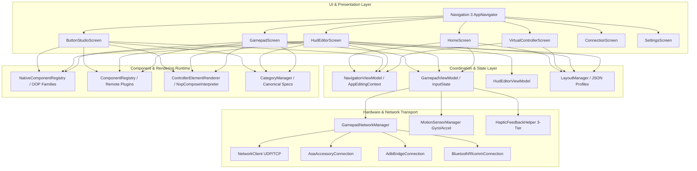
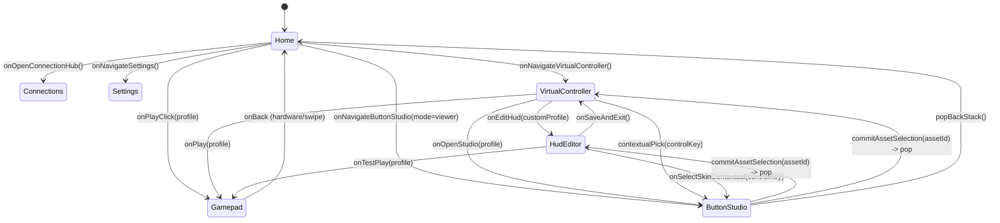
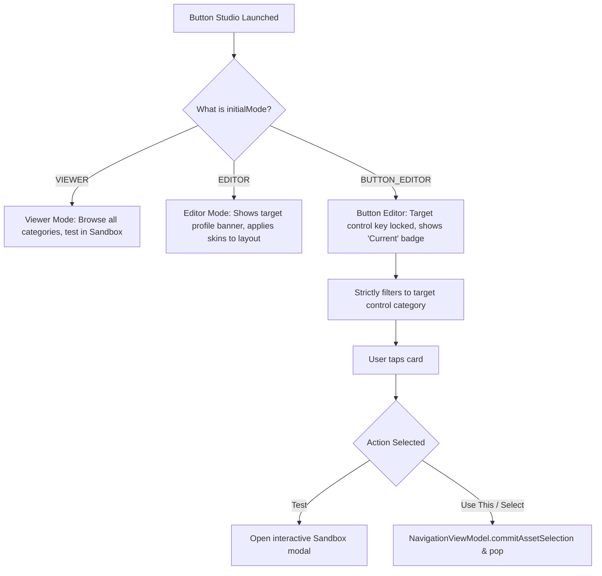
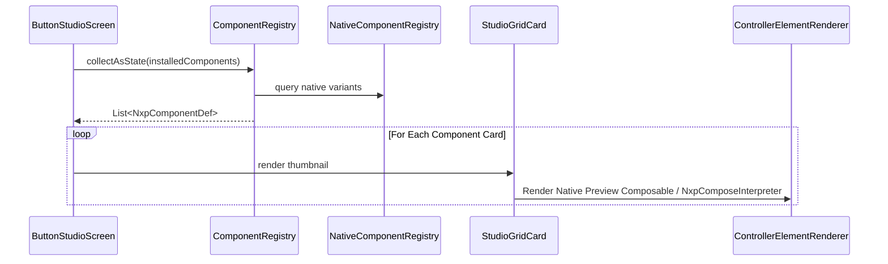
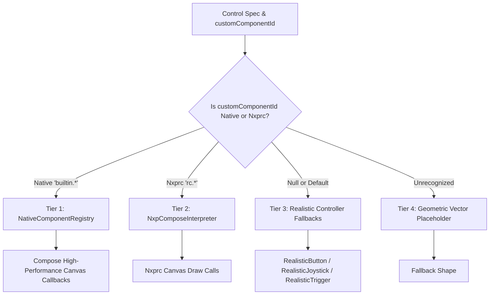
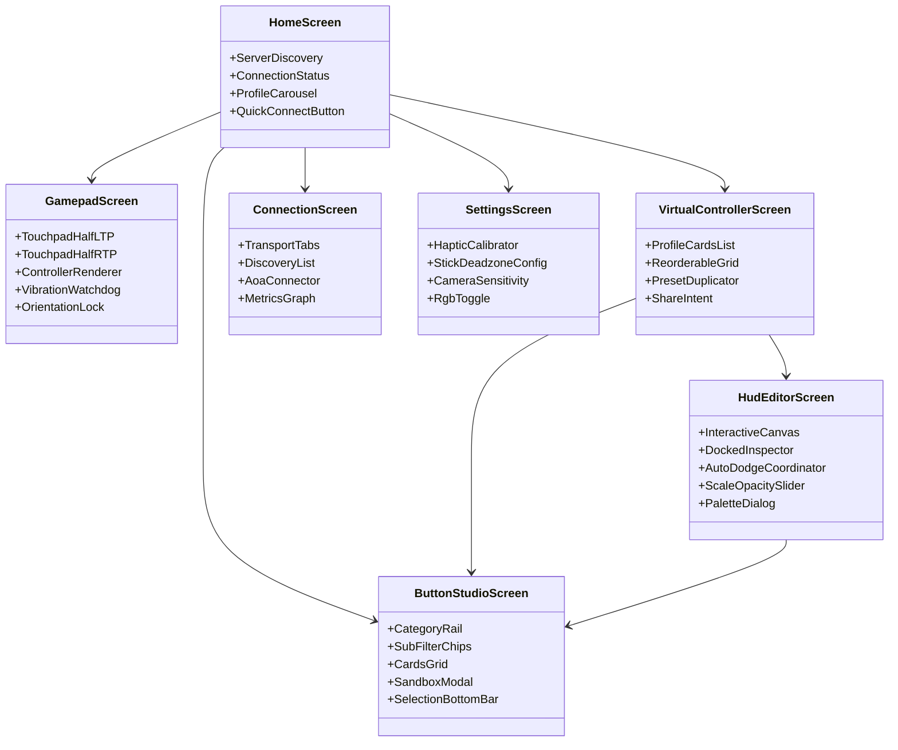

# NEXPAD: Studio Architecture, Code Logic & System Flow Blueprint

> **Document Status**: Complete Architecture & Implementation Reference  
> **Target Branch**: `feature/finaltouch-polish-and-optimization`  
> **Author/Maintainer**: NEXPAD Core Architecture Team  
> **Last Updated**: October 2026

---

## Table of Contents
1. [Executive Summary & High-Level Architecture](#1-executive-summary--high-level-architecture)
2. [Global Navigation & Screen Connectivity Flow](#2-global-navigation--screen-connectivity-flow)
3. [Button Studio Architecture Deep-Dive](#3-button-studio-architecture-deep-dive)
   - 3.1 Operating Modes (`VIEWER`, `EDITOR`, `BUTTON_EDITOR`)
   - 3.2 Component Discovery & Registry Pipeline
   - 3.3 Dynamic Category & Sub-Filter Engine
   - 3.4 Interactive Sandbox Testing Modal
   - 3.5 Contextual Selection & Return Contract
4. [HUD Layout & Controller Rendering Pipeline](#4-hud-layout--controller-rendering-pipeline)
   - 4.1 Layout Profile Architecture & Coordinate System
   - 4.2 4-Tier Component Rendering Pipeline
   - 4.3 In-Built Full Surface Touchpad Architecture
   - 4.4 Dual Labeling & PlayStation Glyphs Engine
5. [Cross-Screen State Management & Data Flow](#5-cross-screen-state-management--data-flow)
   - 5.1 `NavigationViewModel` & `AppEditingContext`
   - 5.2 `LayoutManager` & Persistent Storage
   - 5.3 `GamepadViewModel` & High-Frequency Hardware State
6. [Network & Hardware Communications Layer](#6-network--hardware-communications-layer)
   - 6.1 Multi-Transport Engine (Wi-Fi, USB AOA, ADB, Bluetooth)
   - 6.2 Zero-Allocation Binary Protocol & Input Polling
   - 6.3 3-Tier Adaptive Haptic Engine
7. [Screen-by-Screen Breakdown & Logic Matrix](#7-screen-by-screen-breakdown--logic-matrix)
8. [Final Touch: Optimization, UI Polish & Hardening Plan](#8-final-touch-optimization-ui-polish--hardening-plan)

---

## 1. Executive Summary & High-Level Architecture

NEXPAD is an ultra-low-latency, console-grade Android virtual gamepad application built on **Jetpack Compose**, **Navigation 3**, and a custom reactive architecture. It transforms Android devices into precision gaming controllers for PC and console environments via multi-transport links (UDP Wi-Fi, Android Open Accessory (AOA) 2.0 USB, ADB forward tunnel, and Bluetooth RFCOMM).

### Architectural Layers



---

## 2. Global Navigation & Screen Connectivity Flow

NEXPAD adopts **Android Navigation 3 (`androidx.navigation3`)** with compile-time type-safe destinations declared in `NavKeys.kt`. Navigation transitions use a graph-scoped `NavigationViewModel` to eliminate global sideband singletons (such as legacy static pending keys).

### Route Definition Contract (`NavKeys.kt`)

| Route Key | Target Screen | Parameters & Purpose |
|---|---|---|
| `Route.Home` | `HomeScreen` | Landing screen, quick connect, active layout carousel, network diagnostics. |
| `Route.Settings` | `SettingsScreen` | Haptics, stick deadzones, camera sensitivity, RGB settings, input logs. |
| `Route.Connections` | `ConnectionScreen` | Multi-transport selector (Wi-Fi, USB AOA, ADB, Bluetooth) with live metrics. |
| `Route.Editor` | `HudEditorScreen` | `profileName: String?`, `controlKey: String?`. Freeform canvas layout editor. |
| `Route.VirtualController` | `VirtualControllerScreen` | Layout profile management (CRUD, reorder, share, duplicate, preset lock). |
| `Route.Gamepad` | `GamepadScreen` | `layoutProfileName: String?`. Active 60/120Hz gameplay screen. |
| `Route.ButtonStudio` | `ButtonStudioScreen` | `mode: String`, `profileName: String`, `controlKey: String?`, `currentAssetId: String?`. Component visual studio & contextual picker. |

### Inter-Screen State Machine & Transitions



---

## 3. Button Studio Architecture Deep-Dive

**Location**: `app/src/main/java/com/sanket/tools/nexpad/ui/studio/`

Button Studio is the central design workshop of NEXPAD. It allows browsing, previewing, and selecting skin variants across Native OOP families and external `.nxprc` packages.

### 3.1 Operating Modes (`StudioModels.kt`)

```kotlin
enum class ButtonStudioMode(val label: String) {
    VIEWER("Asset Library"),          // Free browsing and sandbox interactive testing
    EDITOR("Layout Theme Editor"),    // Bulk theme assignment to a LayoutProfile
    BUTTON_EDITOR("Skin Selector")    // Contextual picker for a single specific controlKey
}
```



### 3.2 Component Discovery & Registry Pipeline

NEXPAD discovers component skins from three distinct sources:
1. **`DefaultNativeFamily` (`NativeComponentRegistry.kt`)**: Built-in console-grade procedural Compose components (Flux, Orb, Compass, Gyro, Spotlight joysticks; Lens, Disc, Rails, Metaballs, Capsules D-Pads; Flip, Arc, Led, Ribbed, Tube bumpers; Dial, Bloom, Needle, Slider, Vu, Target triggers; Eclipse, Orbit, Facet, Liquid, Ripple, Capsules face buttons; In-built full-surface touchpads).
2. **`DefaultComponents.kt` (`ComponentRegistry.kt`)**: Built-in default JSON manifests parsed at startup into `NxpComponentDef` items.
3. **`RemoteComponentRegistry.kt`**: Dynamic components imported from `.nxprc` zip archives, desktop sync server, or live ADB push.



### 3.3 Dynamic Category & Sub-Filter Engine (`StudioCategories.kt`)

Components are cataloged dynamically into standard console clusters:
- **Action Buttons (`BUTTON`)**: ABXY clusters, individual face buttons, special macro buttons.
- **D-Pads (`DPAD`)**: Continuous crosshair pads, 4-lens discrete pads, tactile rocker switches.
- **Joysticks & Sticks (`JOYSTICK`)**: Analog sticks (LS, RS) and stick push buttons (LSB, RSB).
- **Bumpers (`BUMPER`)**: Shoulder switches (LB, RB, L1, R1).
- **Triggers (`TRIGGER`)**: Analog pressure triggers (LT, RT, L2, R2).
- **Touchpads (`TOUCHPAD`)**: In-built full-surface touchpads (LTP, RTP) and trackpad overlays.
- **System Buttons (`SYSTEM`)**: Start, Select, Back, Guide, Home, Share.

### 3.4 Interactive Sandbox Testing Modal (`SandboxPreviewModal.kt`)

When tapping "Test" on any component card, Button Studio mounts an isolated sandbox canvas:
- Binds full touch pointer physics to the component.
- Connects live vibration haptics via `HapticFeedbackHelper`.
- Feeds interactive deflection / press states into a transient `GamepadViewModel`.
- Shows real-time coordinate deflection readouts `(X: +0.84, Y: -0.52)` or trigger depth `(94%)`.

### 3.5 Contextual Selection & Return Contract

When `HudEditorScreen` or `VirtualControllerScreen` needs a new skin for a button:
1. Origin screen calls `navigationViewModel.beginAssetSelection(profileName, controlKey, currentAssetId, originScreen)`.
2. Navigation pushes `Route.ButtonStudio(mode = "button_editor", controlKey = "RT", ...)`.
3. Button Studio auto-selects the **Triggers** category and focuses on **RT**.
4. The currently equipped skin displays a cyan `✓ Current` badge.
5. Tapping any variant presents the bottom bar with `Use This Skin`.
6. Tapping `Use This Skin` invokes `navigationViewModel.commitAssetSelection(assetId)` and pops the backstack.
7. Origin screen observes `pendingAssetResult`, assigns the skin, and invokes `navigationViewModel.consumeAssetResult()`.

---

## 4. HUD Layout & Controller Rendering Pipeline

### 4.1 Layout Profile Architecture & Coordinate System

Layouts in NEXPAD are normalized across screen sizes using normalized resolution-independent floating point coordinates:
- `xRatio` $\in [0.0, 1.0]$: Horizontal position relative to screen width.
- `yRatio` $\in [0.0, 1.0]$: Vertical position relative to screen height.
- `scale` $\in [0.5, 2.0]$: Dimension multiplier applied to the component's base intrinsic size.
- `opacity` $\in [0.1, 1.0]$: Alpha transparency.
- `customComponentId`: Asset ID string (e.g., `builtin.flux_ls`, `builtin.inbuild_ltp`, `null` for default 3D).

### 4.2 4-Tier Component Rendering Pipeline



### 4.3 In-Built Full Surface Touchpad Architecture (`InbuildTouchpad.kt`)

The In-Built Touchpad architecture (`builtin.inbuild_ltp` and `builtin.inbuild_rtp`) is designed for maximum screen utilization:
- **Z-Index Lowest**: Rendered as a background layer behind all higher Z-order buttons.
- **Half-Screen Partition**: Center-to-Left consumes LTP space; Center-to-Right consumes RTP space.
- **16.dp Universal Button Buffer Zone**: Dilates every interactive button by 16dp Euclidean margin; touches inside this buffer zone are ignored by the touchpad.
- **Zero Touch Puck Animation**: No distracting puck, outer rings, or vector lines.
- **Static Baseline**:
  - `baseLineAlpha = 0.022f`
  - `tickBaseAlpha = 0.040f`
  - `gradAlpha = 0.020f`
- **Dynamic Touch Surround Aura**: Touching the screen smoothly boosts line, tick, and ambient glow opacity by up to 3x in a localized 120dp radius around the finger, fading back down to static baseline as distance increases or finger lifts.
- **Calibrated 5-Zone Velocity Curve**: Sub-millimeter tracking at low speeds; momentum coasting upon release.

### 4.4 Dual Labeling & PlayStation Glyphs Engine (`PlayStationGlyph.kt`)

NEXPAD supports seamless toggling between Xbox notation (`A, B, X, Y`) and PlayStation glyphs (`✕, ○, □, △`):
- `ControllerLabelStyle.XBOX`: Green A, Red B, Blue X, Yellow Y.
- `ControllerLabelStyle.PLAYSTATION`: Blue ✕ (Cross), Red ○ (Circle), Pink □ (Square), Green △ (Triangle).
- Vector mathematical canvas rendering ensures PlayStation shapes remain crisp at any display density.

---

## 5. Cross-Screen State Management & Data Flow

### 5.1 `NavigationViewModel` & `AppEditingContext`

```kotlin
// Graph-scoped ViewModel lifecycle across screen navigation
class NavigationViewModel : ViewModel() {
    val editingContext: StateFlow<AppEditingContext?>
    val sessionProfileName: StateFlow<String?>

    fun beginAssetSelection(profileName: String, controlKey: String, currentAssetId: String?, originScreen: OriginScreen)
    fun commitAssetSelection(assetId: String)
    fun consumeAssetResult(): String?
    fun cancelAssetSelection()
    fun startGamepadSession(profileName: String?)
    fun clearGamepadSession()
}
```

### 5.2 `LayoutManager` & Persistent Storage

- **Profiles Data Store**: `nexpad_layout_profiles` in `SharedPreferences` storing JSON arrays of `LayoutProfile`.
- **Factory Presets Protection**: Built-in profiles (`Standard Elite`, `Grand MOBA RPG`, `Cyber FPS`, `Retro Arcade`, `Sim Racing Flight`, `PlayStation Style`) are marked `isDefault = true`. Modifying a default layout automatically forks a custom copy.
- **Atomic File Saving**: Every layout change is dispatched asynchronously on `Dispatchers.IO` to prevent UI stutter.

### 5.3 `GamepadViewModel` & High-Frequency Hardware State

- **`GamepadInput`**: Single instance holding all controller states (buttons, axes, triggers, gyro, accelerometer). Zero-allocation memory model avoids GC pauses during intense gaming.
- **StateFlow Architecture**:
  - `isConnected`: Boolean connection watchdog.
  - `connectionStats`: Live RTT ping, packet rates, dropped packets, packet jitter.
  - `discoveredServers`: UDP broadcast discovery results.

---

## 6. Network & Hardware Communications Layer

### 6.1 Multi-Transport Engine

| Transport | Implementation File | Characteristics & Latency |
|---|---|---|
| **UDP Wi-Fi** | `NetworkClient.kt` | Zero-handshake UDP datagrams. Typical latency: **2.0ms – 4.5ms**. Automatic fallback to TCP for handshake negotiation. |
| **USB AOA 2.0** | `AoaAccessoryConnection.kt` | Android Open Accessory protocol over USB cable. Direct bulk endpoints. Latency: **0.4ms – 1.2ms**. Zero network congestion. |
| **ADB Bridge** | `AdbBridgeConnection.kt` | USB cable tunnel via `adb forward tcp:port tcp:port`. Used when accessory mode is unavailable. |
| **Bluetooth RFCOMM**| `BluetoothRfcommConnection.kt` | SPP serial profile over classic Bluetooth. Wireless portability with ~8-12ms latency. |

### 6.2 Zero-Allocation Binary Protocol & Input Polling

```
PACKET STRUCTURE (Standard Binary Mode):
[0xAA 0x55] : 2 bytes magic header
[seq]       : 4 bytes packet sequence ID
[buttons]   : 4 bytes bitmask (A, B, X, Y, D-Pad, LB, RB, Start, Select, Guide, L3, R3, etc.)
[axis_LX]   : 2 bytes signed short (-32768 to 32767)
[axis_LY]   : 2 bytes signed short (-32768 to 32767)
[axis_RX]   : 2 bytes signed short (-32768 to 32767)
[axis_RY]   : 2 bytes signed short (-32768 to 32767)
[trigger_LT]: 1 byte unsigned char (0 to 255)
[trigger_RT]: 1 byte unsigned char (0 to 255)
[motion]    : 12 bytes 6-axis gyro/accelerometer data
[crc16]     : 2 bytes CRC error check
```

### 6.3 3-Tier Adaptive Haptic Engine (`HapticFeedbackHelper.kt`)

NEXPAD queries the hardware vibrator capabilities and automatically assigns one of three operational tiers:
- **Tier 1 (Legacy / Binary)**: Pre-Android O or devices without amplitude control. Dispatches crisp micro-duration pulses.
- **Tier 2 (ERM Spinning Motor)**: Devices with amplitude modulation but no pre-baked waveforms. Streams quantized rumble intensity.
- **Tier 3 (LRA Haptic Actuator)**: Flagship devices (Pixel, Samsung Galaxy, OnePlus) with hardware haptic primitives. Renders tactile clicks, tick pulses, and HD directional rumble.

---

## 7. Screen-by-Screen Breakdown & Logic Matrix



---

## 8. Final Touch: Optimization, UI Polish & Hardening Plan

As we begin work on `feature/finaltouch-polish-and-optimization`, the following specific tasks form our execution roadmap:

### Priority 1: Performance & Recomposition Hardening
- [ ] **Canvas Lambdas Audit**: Ensure all drawing modifiers in buttons and touchpads use `Modifier.drawBehind` or `Modifier.drawWithCache` to avoid unnecessary layout/recomposition passes.
- [ ] **State Read Deflection Isolation**: Ensure analog stick deflection changes read states inside `Modifier.graphicsLayer` or draw scopes rather than triggering top-level recomposition.
- [ ] **Haptic Rate-Limiting**: Verify vibration calls on high-frequency drag events never exceed the hardware minimum period (preventing thread starvation).

### Priority 2: UI Precision & Visual Polish
- [ ] **Touchpad Ambient Contrast**: Validate ambient grid visibility across dark OLED displays and IPS LCD panels.
- [ ] **Button Studio Cards Aspect Ratio**: Standardize card padding and vertical rail spacing on narrow phones vs wide tablets.
- [ ] **HUD Auto-Dodge Tuning**: Verify that the docked inspector smoothly slides out of the way regardless of which edge the button is moved to.

### Priority 3: Edge-to-Edge & System Bar Insets
- [ ] **Cutout Margin Validation**: Guarantee that landscape notch avoidance doesn't clip shoulder bumpers (`LB/RB`) or triggers (`LT/RT`) on phones with deep punch-hole cameras.
- [ ] **Full Immersive Watchdog**: Ensure swipe gestures don't permanently leave system bars visible during gameplay.

### Priority 4: Test Suite & Code Hygiene
- [ ] **Zero Suppressions Guarantee**: Maintain 100% compliance with zero `@Suppress` and zero `@SuppressLint`.
- [ ] **Automated Screenshot & Unit Tests**: Ensure all JUnit unit tests pass continuously before every merge.
